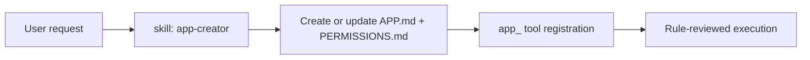

# Apps

Apps are sandboxed tool wrappers discovered from `<workspace>/apps/<app-id>/APP.md` and
`<workspace>/apps/<app-id>/PERMISSIONS.md`.

Each app registers as a callable tool: `app_<id>`.

## Why Apps

- Isolate semi-trusted capabilities behind explicit rules
- Run app logic in a one-shot subagent
- Review every app tool call with a separate model before execution

## App Layout

```text
<workspace>/apps/
  <app-id>/
    APP.md
    PERMISSIONS.md
    data/
    scripts/
```

- `APP.md` defines identity and app system prompt.
- `PERMISSIONS.md` defines source intent text and allow/deny rules.
- `data/` is the only writable location for the app subagent.
- Other agents are denied access to `workspace/apps/*`.

## Execution Flow

```mermaid
graph LR
  Caller[Agent] -->|app_<id>(prompt)| AppTool
  AppTool --> AppSubagent[App Subagent]
  AppSubagent -->|tool call| Review[Review Middleware]
  Review -->|ALLOW| RealTool[read/write/edit/exec]
  Review -->|DENY| AppSubagent
  AppSubagent --> Caller
```

## Rule Management

`app_rules` supports asymmetric confirmation:

- `add_deny`: no confirmation
- `add_allow`: requires `confirmed=true`
- `remove_deny`: requires `confirmed=true`
- `remove_allow`: no confirmation

Security-tightening actions do not require confirmation; security-loosening actions do.

## App Creator Skill

Daycare includes a core `app-creator` skill at
`packages/daycare/sources/skills/app-creator/SKILL.md` for creating and iterating
on app definitions.

Use it when building or updating:
- `APP.md` frontmatter + system prompt
- `PERMISSIONS.md` source intent + rule sets
- app allow/deny rule sets
- app folder layout (`data/`, optional `scripts/`)


