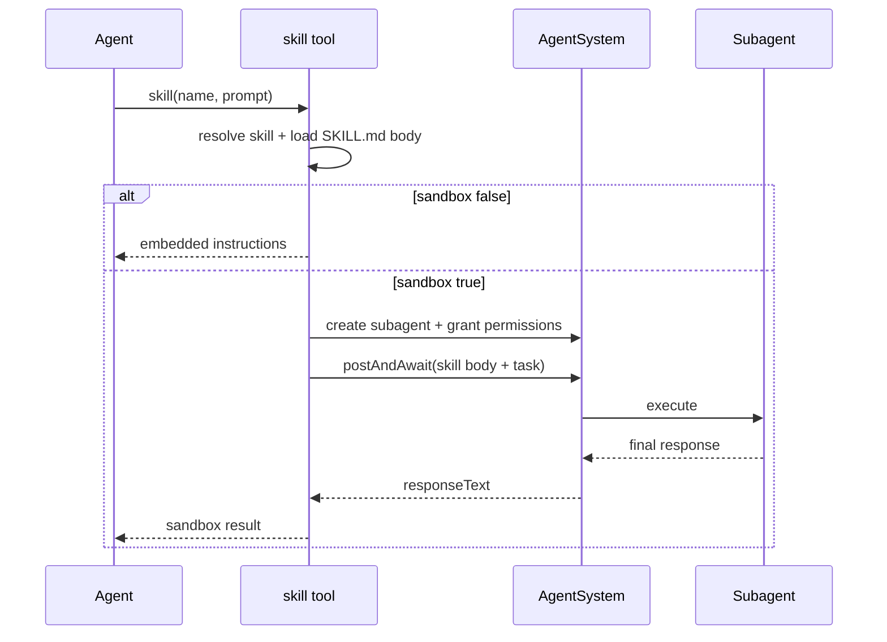

# Skills

Skills are opt-in prompts stored as files on disk. They are **not** loaded into the system prompt automatically. Agents invoke skills via the `skill` tool.

## Where skills live

| Location | Purpose |
|----------|---------|
| `packages/daycare/sources/skills/` | Core built-in skills |
| `~/.daycare/skills/` | Config-local skills |
| `~/.agents/skills/` | Shared home-directory skills |
| Plugin-registered via `registerSkill(path)` | Plugin-provided skills |

Each skill is a folder containing a `SKILL.md` file. The folder name becomes the skill name shown to the agent.

## SKILL.md format

```markdown
---
name: my-skill
description: Brief description of what this skill does and when to use it.
---

Skill content in Markdown...
```

### Required frontmatter

| Field | Constraints |
|-------|------------|
| `name` | 1-64 chars, lowercase letters/numbers/hyphens, must match folder name |
| `description` | 1-1024 chars |

### Optional frontmatter

`license`, `compatibility`, `metadata`, `allowed-tools`

## Loading

1. The system prompt lists available skills with metadata (name, description, source, sandbox flag)
2. The agent calls `skill(name: "...")`
3. Non-sandbox skills return instructions to follow in-context; sandbox skills run in a subagent and return results

Skills are loaded fresh each time the system prompt is built, so edits take effect immediately.

## Sandbox execution

Add optional frontmatter for isolated runs:

```markdown
---
name: deploy
description: Deploy application safely.
sandbox: true
permissions:
  - "@read:/workspace"
  - "@network"
---
```

When `sandbox: true`, the `skill` tool creates a subagent, grants declared permissions (bounded by caller permissions), executes the skill with the provided prompt, and returns the subagent response.



## Skill IDs

The skill catalog uses stable ID prefixes by source:
- `core:<relative-path>`
- `config:<relative-path>`
- `user:<relative-path>`
- `plugin:<plugin-id>/<relative-path>`
