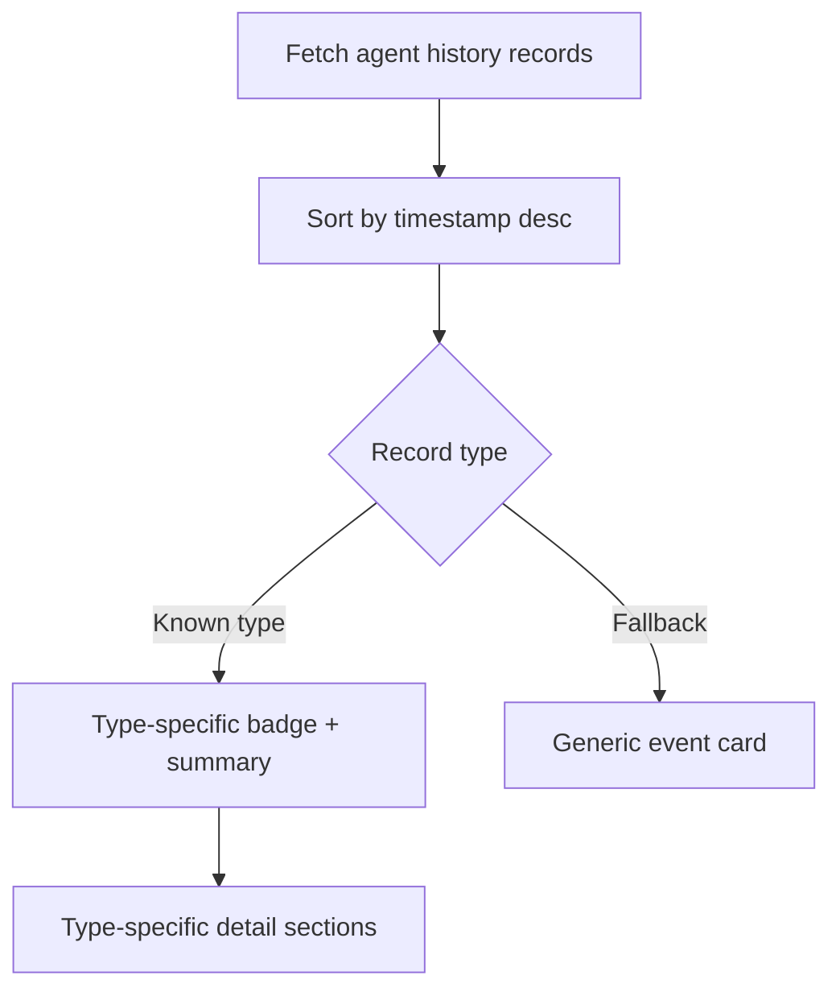

# Dashboard History Record Types

The agent detail page now renders all persisted history record variants returned by
`GET /v1/engine/agents/:agentId/history`.

## Covered record types

- `start`
- `reset`
- `user_message`
- `assistant_message`
- `tool_result`
- `rlm_start`
- `rlm_tool_call`
- `rlm_tool_result`
- `rlm_complete`
- `assistant_rewrite`
- `note`

## Rendering flow

