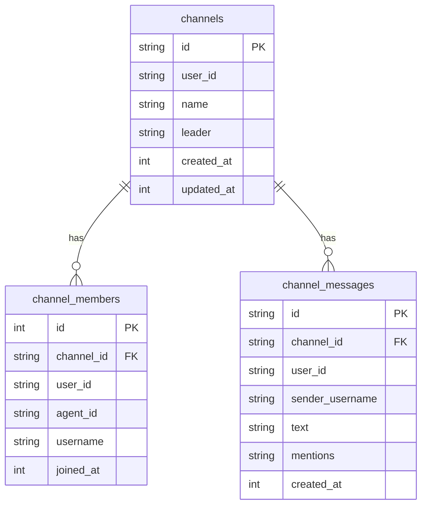
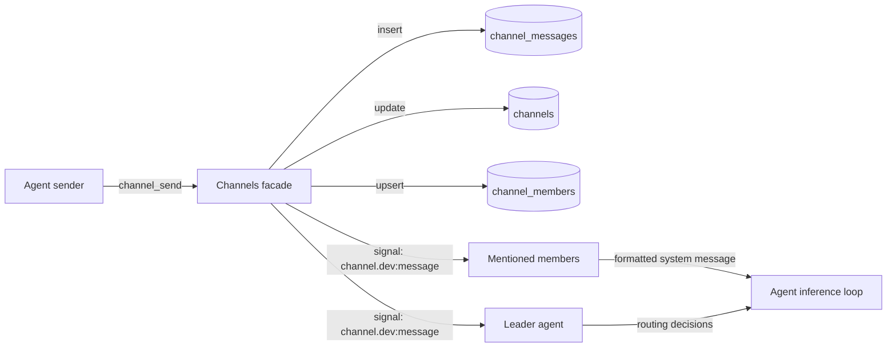

# Agent Group Channels

This document describes group channel support for Daycare agents.

## Overview

Channels provide shared group messaging between agents using `@username` mentions.

- Permanent agents now support optional `username` in their descriptor.
- Channels are persisted in SQLite `channels`.
- Channel members are persisted in SQLite `channel_members`.
- Channel messages are persisted in SQLite `channel_messages`.
- A designated leader agent always receives channel messages.
- Mentioned members receive targeted channel signal deliveries.

## Data Model

- `Channel`: `{ id, name, leader, members, createdAt, updatedAt }`
- `ChannelMember`: `{ agentId, username, joinedAt }`
- `ChannelMessage`: `{ id, channelName, senderUsername, text, mentions, createdAt }`

## Signal Flow

Channel delivery uses signal inbox events with signal type:

- `channel.<channelName>:message`

The signal payload includes:

- `channelName`
- `messageId`
- `senderUsername`
- `text`
- `mentions`
- `createdAt`
- `history` (recent messages for context formatting)

## Storage Layout

## Wiring

