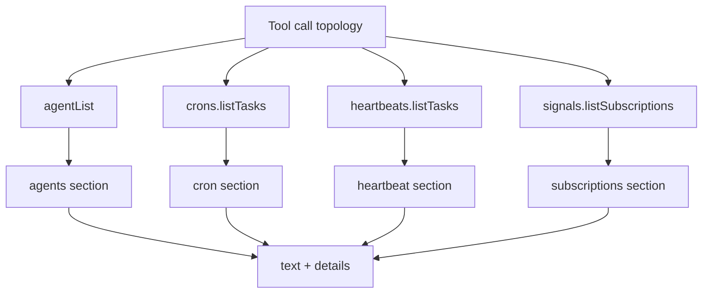

# Topology Tool

Daycare provides a unified `topology` tool for runtime discovery. It returns:

- persisted agents (`agentList(config)`)
- cron tasks (`crons.listTasks()`)
- heartbeat tasks (`heartbeats.listTasks()`)
- signal subscriptions (`signals.listSubscriptions()`)

Items belonging to the calling agent are marked with `(You)` in text output and `isYou: true` in `details`.

