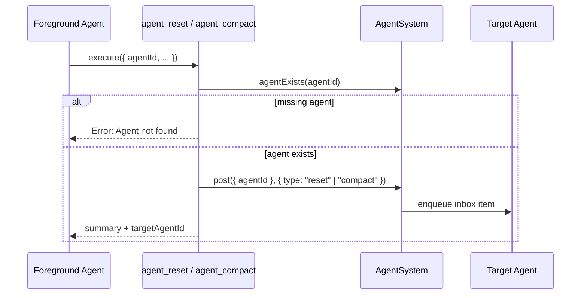

# Agent Session Control Tools

Daycare now includes two core tools for cross-agent session control:

- `agent_reset` posts `{ type: "reset", message?: string }` to a target agent inbox.
- `agent_compact` posts `{ type: "compact" }` to a target agent inbox.

Both tools:

- require `agentId`
- reject self-targeting (`agentId === caller agent id`)
- verify target existence via `agentSystem.agentExists(agentId)`
- return a typed summary with `targetAgentId`

Both tools are hidden from background agents by `toolListContextBuild` denylist filtering.

