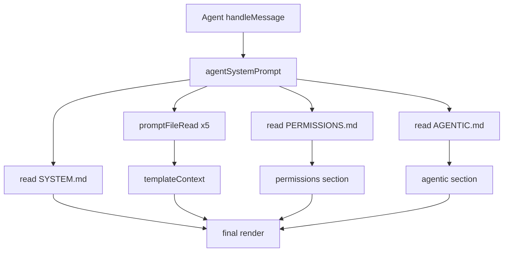

# Agent System Prompt Build

System prompt rendering is centralized in `agentSystemPrompt()` and called from `Agent`.

It loads prompt files (`SOUL.md`, `USER.md`, `AGENTS.md`, `TOOLS.md`, `MEMORY.md`), renders
`PERMISSIONS.md` and `AGENTIC.md`, then renders `SYSTEM.md` with the merged context.

