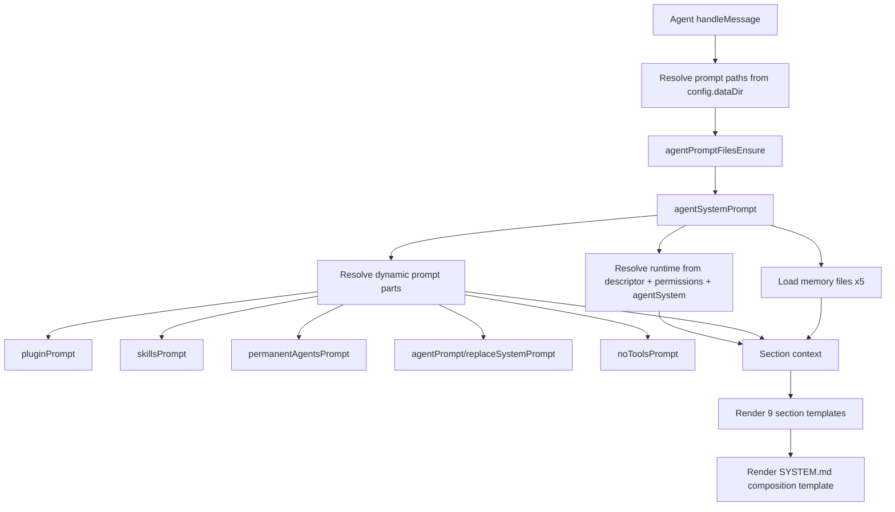

# Agent System Prompt

System prompt rendering is centralized in `agentSystemPrompt()` and called from `Agent`.

`Agent` now passes only:
- `descriptor`
- `permissions`
- selected `provider`/`model`
- `agentSystem`

`Agent` ensures prompt files before prompt rendering using:
- `agentPromptPathsResolve(config.dataDir)`
- `agentPromptFilesEnsure(paths)`

`agentSystemPrompt()` derives connector, cron, app-folder, and feature context internally, loads memory files (`SOUL.md`, `USER.md`, `AGENTS.md`, `TOOLS.md`, `MEMORY.md`), then renders deterministic sections:
- Preamble
- Permissions
- Autonomous operation
- Workspace
- Tool Calling
- Agents, Topology, Signals, Channels
- Skills
- Messages
- Files

