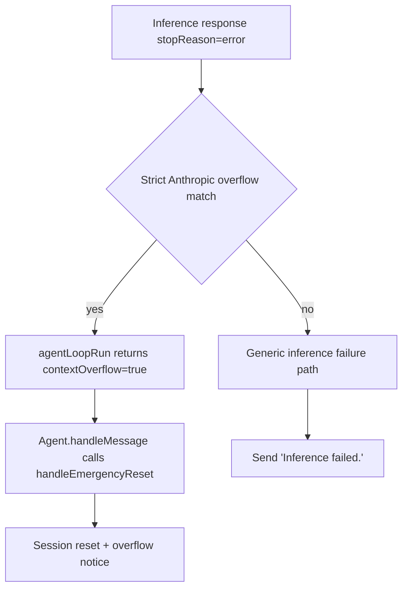

# Anthropic Prompt Overflow Reset

When Anthropic returns a provider-side `stopReason="error"` for prompt overflow, the agent now resets the session
instead of replying with generic `Inference failed.`.

The detection is strict and only matches:

- provider id is `anthropic`
- serialized error starts with status `400`
- JSON payload `error.type === "invalid_request_error"`
- JSON payload `error.message` contains both `"prompt is too long: "` and `"maximum"`

## Flow

