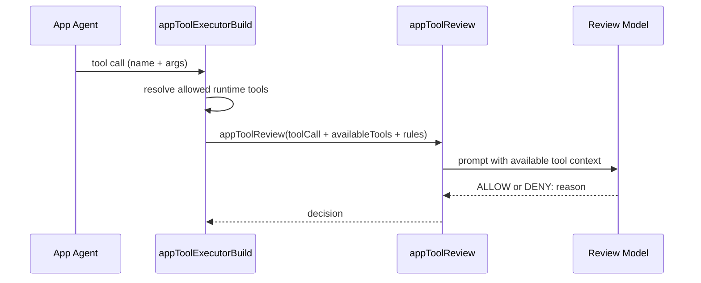

# App Review Tool Context

App review prompts now include the exact set of tools available to the running
app sandbox (name, description, and parameter schema).

This prevents false denials where the reviewer confuses Daycare tool names with
language/runtime built-ins (for example, interpreting tool `exec` as Python
`exec()`).

## Prompt flow

## Prompt additions

- Added section: `## Available Tools In This Sandbox`
- Added tool entries:
  - `Name`
  - `Description`
  - `Parameters` (JSON schema)
- Added explicit interpretation guard:
  - evaluate against provided tool list only
  - do not reinterpret names by language built-ins
