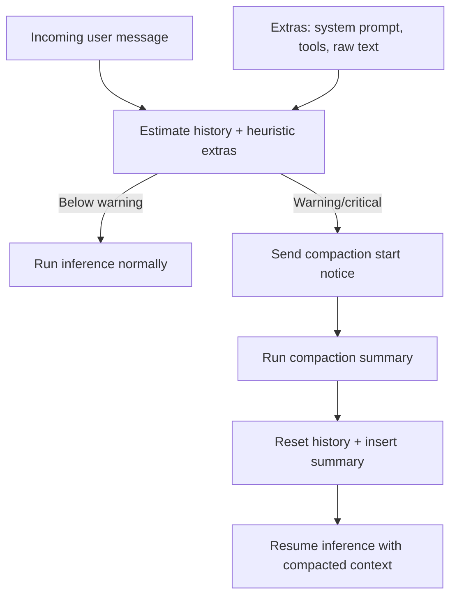
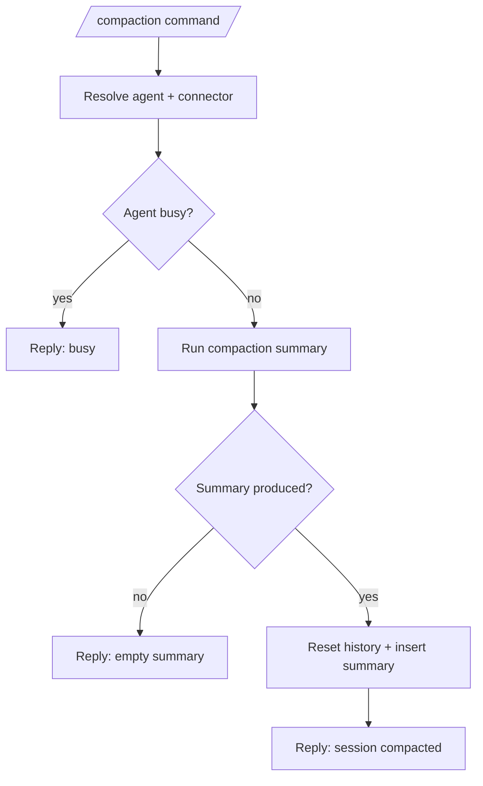

# Context compaction

Daycare runs automatic compaction to avoid hard context overflows. The agent estimates context usage
from recent history plus the current system prompt and compacts when thresholds are crossed.

## Strategy

- Warning threshold: 75% of `settings.agents.emergencyContextLimit`.
- Critical threshold: 90% of `settings.agents.emergencyContextLimit`.
- Estimates include history plus heuristic extras (system prompt, tool payloads, incoming raw text).
- When warning/critical, the agent notifies the user that compaction is starting, runs compaction
  immediately, and resumes inference with the compacted context.

## Compaction summary handling

When compaction runs, the agent:
1) records a reset marker in history
2) appends the compaction summary as a user message with an instruction to continue
3) resumes with the latest user message appended after the summary

## Flow

## Manual compaction command

Users can request manual compaction with `/compaction` (alias `/compact`).

