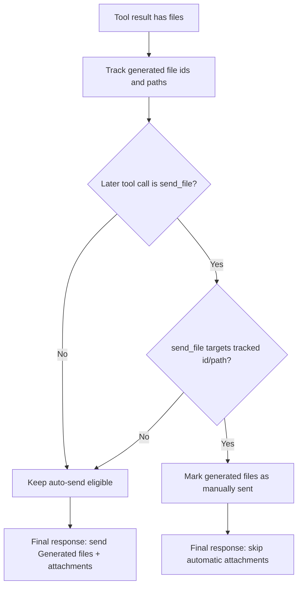

# Generated File Delivery Dedup

`agentLoopRun` now avoids sending duplicate files when a model calls `send_file` for a file that was already generated in the same tool loop.

## Problem

Before this change:
1. `generate_image` returned files.
2. The loop auto-sent those files as `Generated files.`.
3. The model could also call `send_file` for the same file path/id.

This produced duplicate image delivery to the same chat.

## Behavior

- Track generated file ids and paths while tools execute.
- Track workspace file aliases exposed by tool details.
- If `send_file` references a tracked generated file, suppress the final automatic file send for that turn.
- Keep automatic sending when no manual `send_file` happened for generated files.

## Flow

