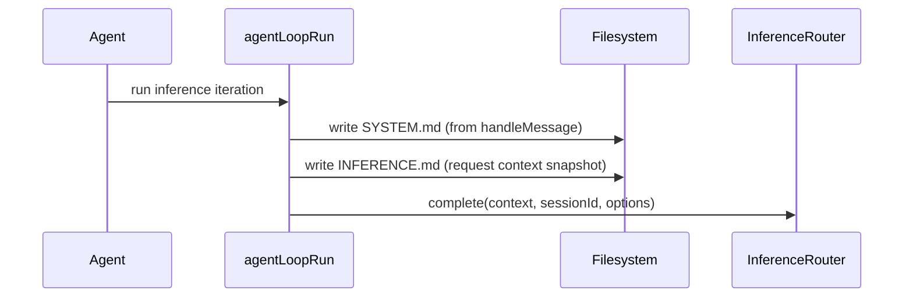

# Inference Prompt Snapshot (`INFERENCE.md`)

Daycare now writes `INFERENCE.md` in each agent folder before every inference
call. This file sits next to `SYSTEM.md` and contains the exact `Context`
payload passed to `InferenceRouter.complete()`.

## Why

When debugging provider behavior, we need the precise request body that reached
the model call path, not a reconstructed prompt.

## Flow

## Implementation

- `packages/daycare/sources/engine/agents/ops/agentInferencePromptWrite.ts`
- `packages/daycare/sources/engine/agents/ops/agentLoopRun.ts`
