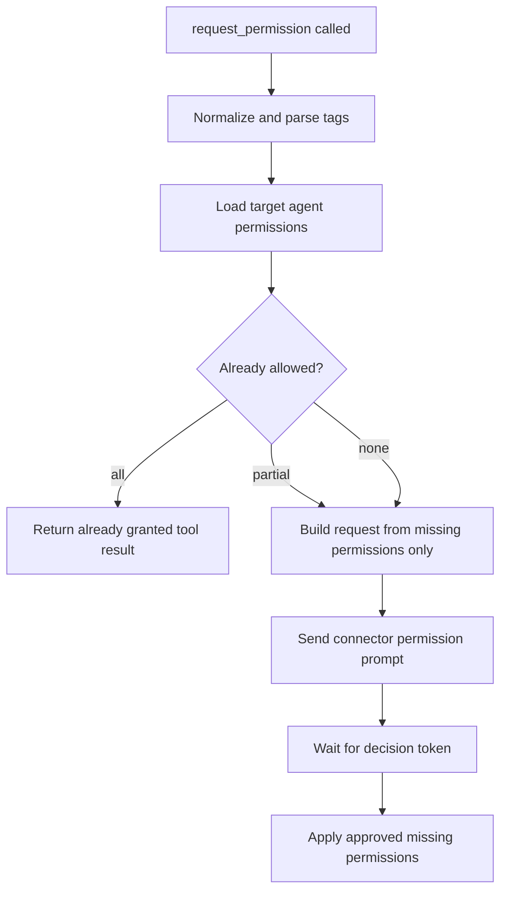

# Permission Request Existing Grants

## Summary

`request_permission` now checks the target agent's current permissions before emitting a connector prompt.
If all requested permissions are already available, the tool returns immediately and does not create a pending approval token.
If only some are missing, only the missing subset is sent to the user.

## Flow

