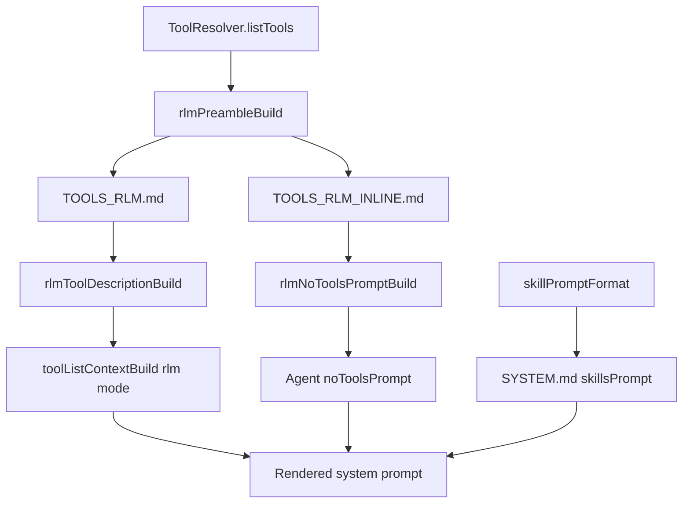

# Prompt Tools Restructure

RLM tool-mode prompt text now lives in bundled markdown templates:

- `sources/prompts/TOOLS_RLM.md` for `run_python` tool-call mode
- `sources/prompts/TOOLS_RLM_INLINE.md` for no-tools `<run_python>` tag mode

Both builders inject only the Python preamble (`{{{preamble}}}`) and no longer include
skill lists. Skills are injected once through `skillsPrompt` in `SYSTEM.md`.

