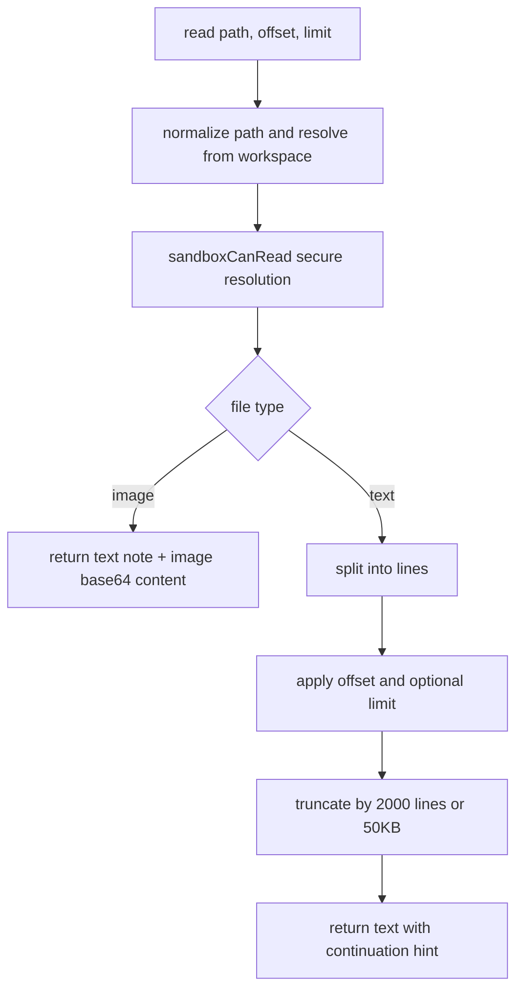

# Read Tool Robustness

`packages/daycare/sources/plugins/shell/tool.ts` now uses the same robust read behavior pattern used in the reference coding-agent implementation.

## What changed

- Accepts relative or absolute `path`.
- Adds optional `offset` and `limit` for line-based pagination.
- Truncates text by whichever limit is hit first:
  - `2000` lines
  - `50KB`
- Emits actionable continuation hints (`Use offset=... to continue.`).
- Detects supported images (`jpeg`, `png`, `gif`, `webp`) and returns image content blocks.
- Applies macOS-friendly path fallbacks for screenshot-like filenames:
  - AM/PM narrow no-break space variant
  - NFD unicode normalization
  - Curly apostrophe variant

## Read Flow

