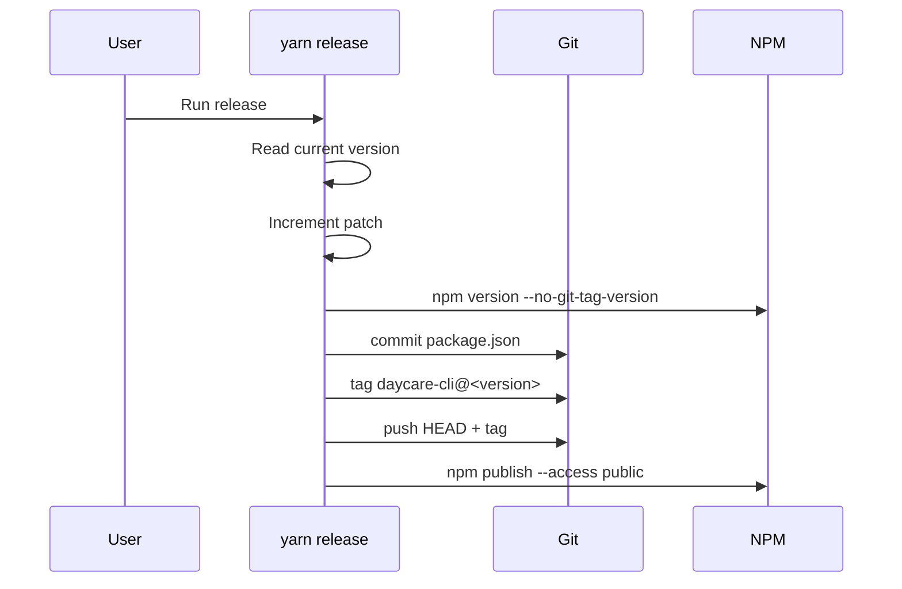

# Release command

`yarn release` now orchestrates publishing `daycare-cli` from the monorepo root.

## Flow

1. Read current `daycare-cli` version from `packages/daycare/package.json`.
2. Increment the patch segment (`x.y.z -> x.y.(z+1)`).
3. Run `npm version <version> --no-git-tag-version` in `packages/daycare`.
4. Commit `packages/daycare/package.json`.
5. Create tag `daycare-cli@<version>`.
6. Push branch and tag to `origin`.
7. Run `npm publish --access public` from `packages/daycare`.

## Sequence

