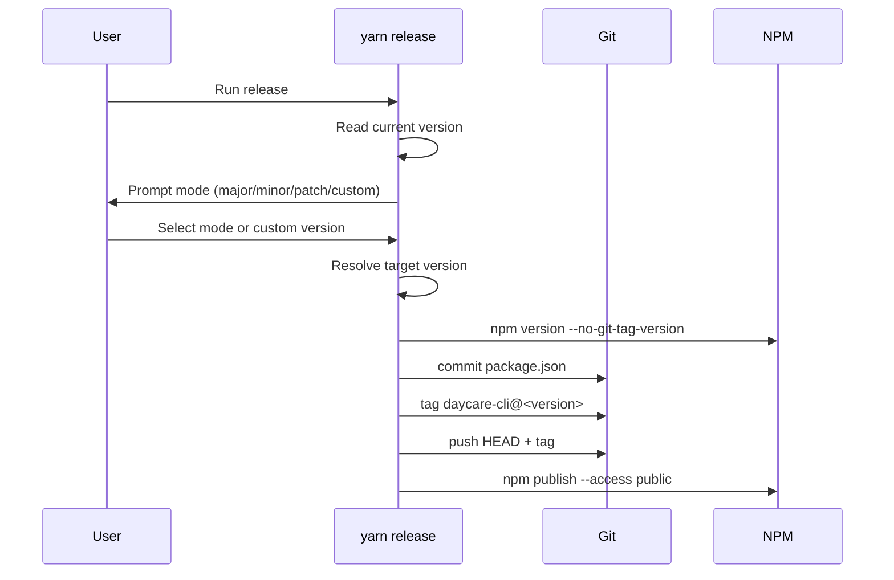

# Release command

`yarn release` now orchestrates publishing `daycare-cli` from the monorepo root.

## Flow

1. Read current `daycare-cli` version from `packages/daycare/package.json`.
2. Prompt for release mode (`patch`, `minor`, `major`, or `custom`).
3. Resolve next version from the selected mode.
4. Run `npm version <version> --no-git-tag-version` in `packages/daycare`.
5. Commit `packages/daycare/package.json`.
6. Create tag `daycare-cli@<version>`.
7. Push branch and tag to `origin`.
8. Run `npm publish --access public` from `packages/daycare`.

## Sequence

