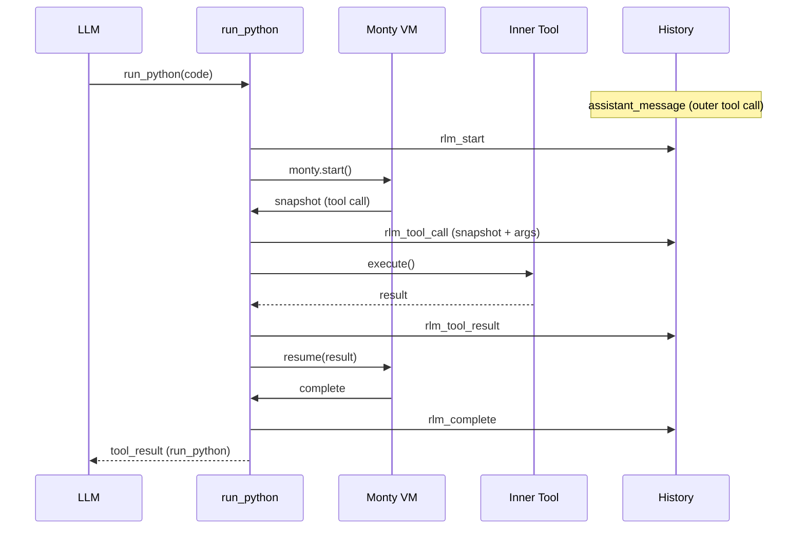
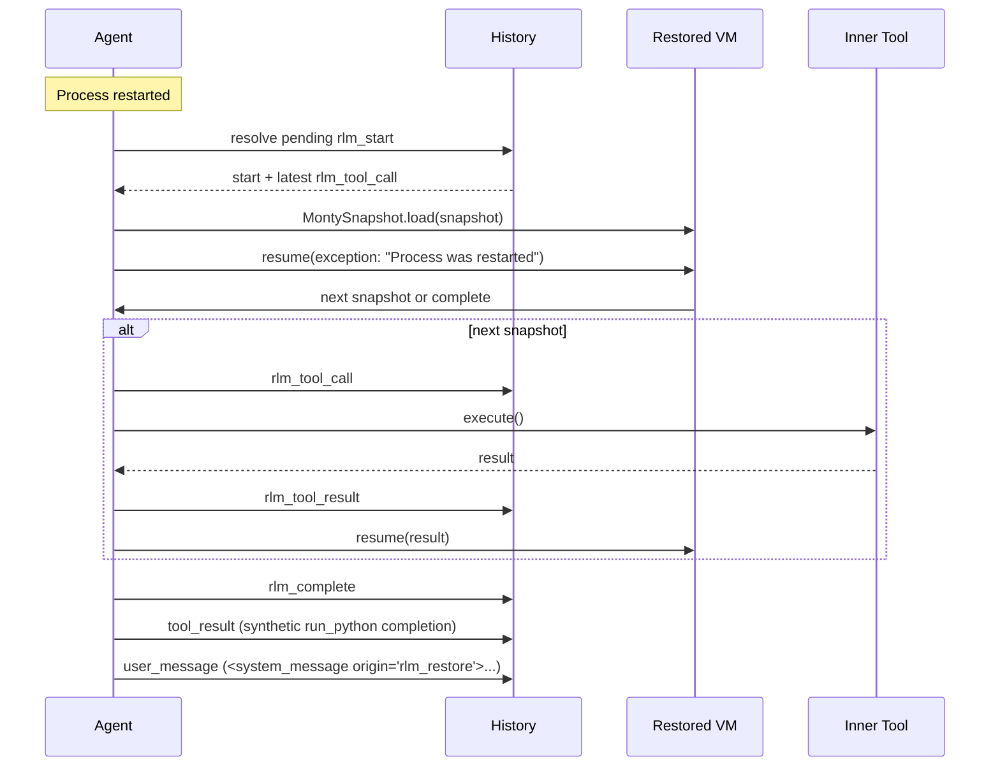

# RLM Checkpointing

## Overview

RLM checkpointing persists `run_python` interpreter progress into agent history so execution can survive a process restart.

Each `run_python` call now writes:

- `rlm_start` when execution begins
- `rlm_tool_call` before each inner tool call (includes VM snapshot)
- `rlm_tool_result` after each inner tool call
- `rlm_complete` when execution ends (success or error)

The outer assistant/tool protocol remains unchanged:

- assistant emits the `run_python` tool call
- `tool_result` completes that outer call

RLM checkpoint records are internal and are skipped when rebuilding model context.

## Normal Flow

## Restore Flow

## Record Reference

- `rlm_start`
  - `toolCallId`, `code`, `preamble`
- `rlm_tool_call`
  - `toolCallId`, base64 `snapshot`, `printOutput`, `toolCallCount`, `toolName`, `toolArgs`
- `rlm_tool_result`
  - `toolCallId`, `toolName`, `toolResult`, `toolIsError`
- `rlm_complete`
  - `toolCallId`, `output`, `printOutput`, `toolCallCount`, `isError`, optional `error`

## Startup Recovery Behavior

- Startup scans history for an `rlm_start` without a matching `rlm_complete`.
- If a snapshot exists, execution resumes from that snapshot and injects a runtime error (`Process was restarted`) into the pending Python tool call.
- If no snapshot exists, recovery marks the run as failed (`rlm_complete` with error).
- In both paths, history is completed with:
  - synthetic outer `tool_result` for `run_python`
  - synthetic system-origin user message with `origin="rlm_restore"`
