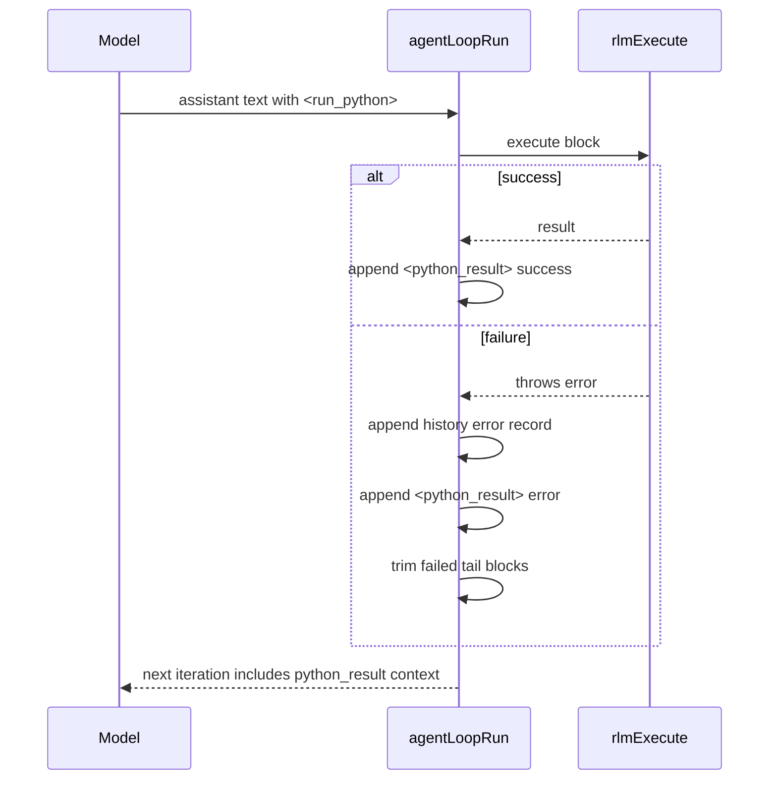

# RLM Inline Error `<python_result>` Injection

In no-tools RLM inline mode, failed `<run_python>` blocks now inject an error
`<python_result>` user message into context, matching the success path behavior.

## Why

Previously, on failure we only wrote history records and stopped executing remaining
blocks. Because raw `<run_python>` text is suppressed and `<say>` output is selective,
users could receive an empty response in some turns.

## Flow

## Code

- `packages/daycare/sources/engine/agents/ops/agentLoopRun.ts`
