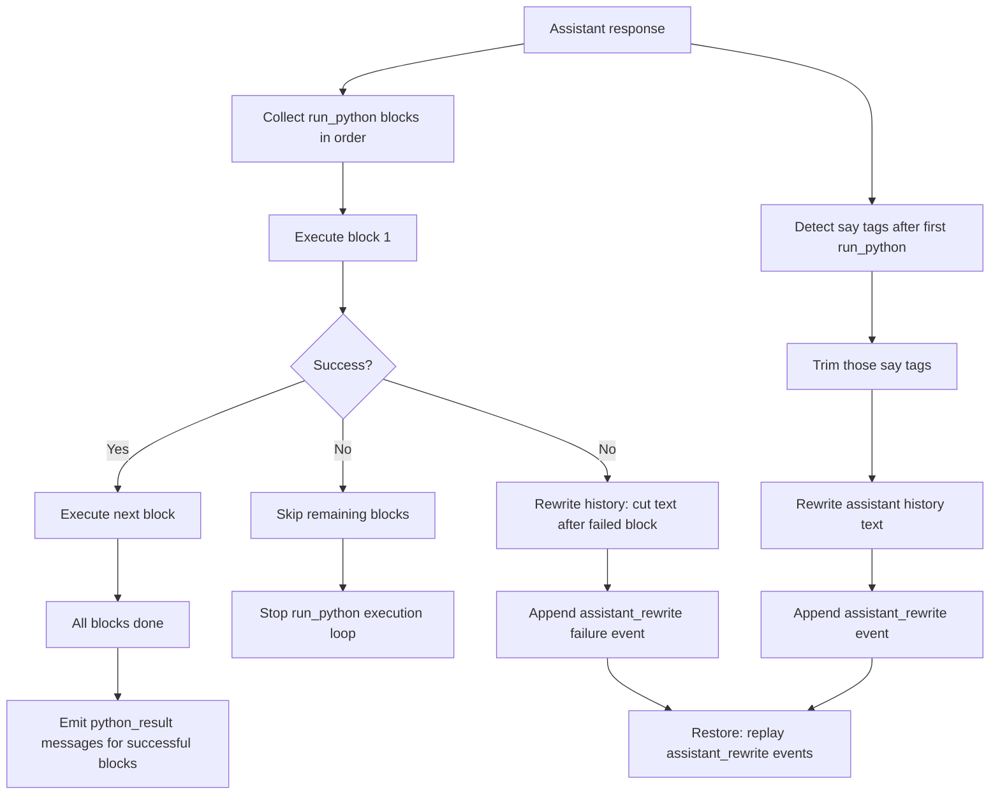

# RLM Multiline Python Guidance

Updated prompt guidance for inline RLM Python execution and response-tag handling.

## Summary
- Added inline-mode support for multiple `<run_python>` tags per assistant response.
- Added sequential execution semantics: execute in order and stop at first failed block.
- Added strict post-`<run_python>` `<say>` suppression via rewrite-only trimming.
- Rewrote assistant text in context history to remove `<say>` tags after `<run_python>`.
- On first failed `<run_python>` block, rewrote context history to drop everything after the failed block.
- Removed synthetic ignored/failure notices from no-tools message flow when rewrite trimming applies.
- Persisted explicit `assistant_rewrite` history events for each rewrite.
- Restore now replays `assistant_rewrite` events directly (no trim recomputation on load).
- Extracted trim logic into ops helpers:
  `agentMessageRunPythonSayAfterTrim()` and `agentMessageRunPythonFailureTrim(successfulExecutionCount)`.
- Updated inline prompt examples to show multi-tag execution and ignored post-run `<say>`.
- Clarified that tool calls return plain LLM strings, not structured payloads.
- Added test assertions so these instructions stay present.

## Flow

