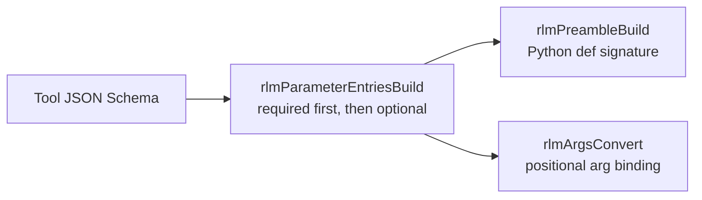

# RLM Parameter Ordering

RLM positional tool arguments now follow the same required-first ordering in both:
- Python stub signatures (`rlmPreambleBuild`)
- Runtime argument conversion (`rlmArgsConvert`)

This is centralized in `rlmParameterEntriesBuild`.

