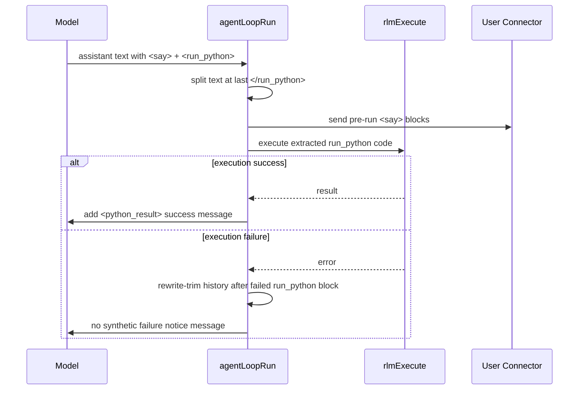

# Daycare RLM `<say>` + `<run_python>` Flow

## Summary

In no-tools RLM mode, `<say>` blocks are split at the first `<run_python>` tag:
- `<say>` before the first `<run_python>` is sent immediately.
- `<say>` after the first `<run_python>` is trimmed and not delivered.
- On execution failure, the failed block is rewrite-trimmed from context history tail and no failure notice message is injected.

This keeps user-visible messages aligned with actual execution state while preserving full assistant text in context/history.

## Sequence

