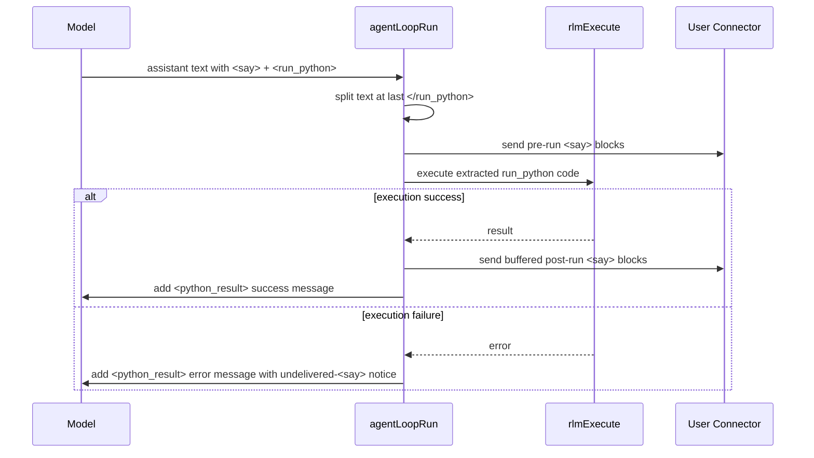

# Daycare RLM `<say>` + `<run_python>` Flow

## Summary

In no-tools RLM mode, `<say>` blocks are now split around the last `</run_python>` tag:
- `<say>` before `</run_python>` is sent immediately.
- `<say>` after `</run_python>` is buffered and sent only when Python execution succeeds.
- On execution failure, buffered post-`run_python` `<say>` blocks are not sent and a notice is prepended at the beginning of the `<python_result>` body (with singular/plural count).

This keeps user-visible messages aligned with actual execution state while preserving full assistant text in context/history.

## Sequence

