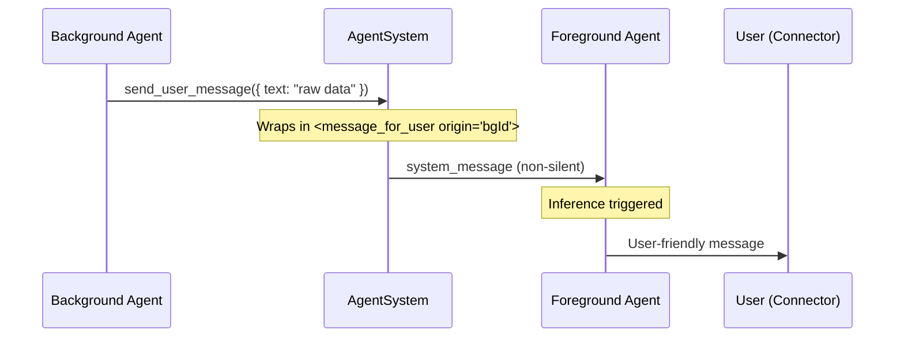

# send_user_message Tool

Background agents cannot message users directly. The `send_user_message` tool lets them route user-facing content through the foreground agent, which rephrases and delivers it.

## Flow

## Key Files

| File | Purpose |
|------|---------|
| `engine/modules/tools/sendUserMessageTool.ts` | Tool definition and execution |
| `engine/messages/messageBuildUserFacing.ts` | Builds `<message_for_user>` XML tag |
| `engine/messages/messageIsUserFacing.ts` | Detects `<message_for_user>` tag |
| `engine/modules/tools/toolListContextBuild.ts` | Filters tool to background-only |
| `prompts/SYSTEM.md` | Prompt instructions for handling the tag |

## Design Decisions

- **Background-only**: Foreground agents talk to users directly; this tool is filtered out via `FOREGROUND_TOOL_DENYLIST`.
- **Non-silent delivery**: The system message triggers inference so the foreground agent actively responds.
- **Distinct XML tag**: Uses `<message_for_user>` instead of `<system_message>` so the foreground agent can distinguish user-facing content from internal updates.
- **Target resolution**: Subagents route to their parent; other agents route to the most recent foreground agent.
