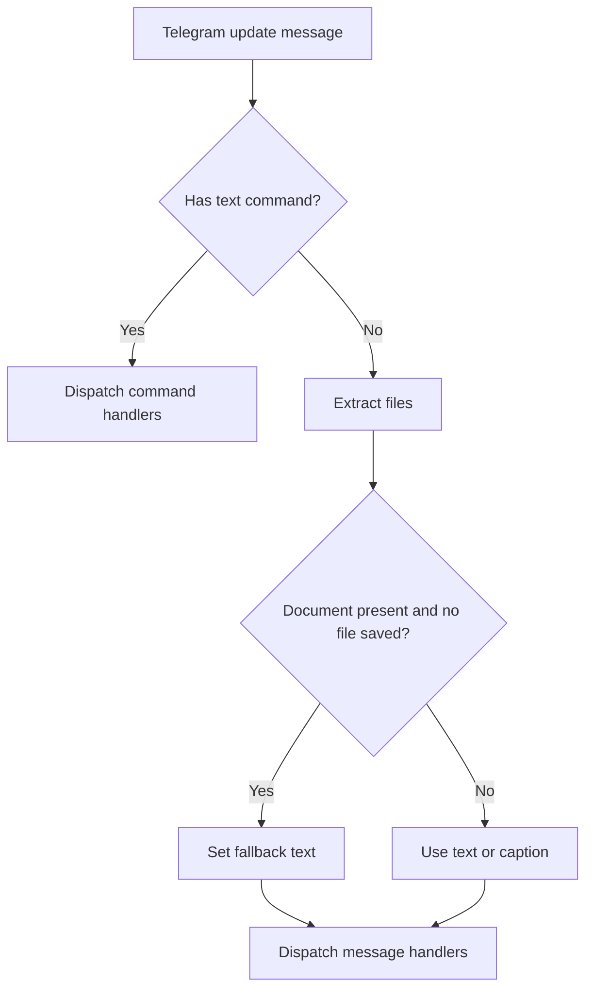

# Telegram Document Receive Fallback

## Summary

Telegram document updates now always reach agent handlers, even when file download fails.  
When a document-only message cannot be downloaded, the connector emits a fallback text message instead of an empty payload.

## Behavior

- Successful document download: message contains `files`.
- Failed document download with no text/caption: message contains fallback text (`Document received ... (download failed).`).
- Existing text/caption behavior remains unchanged.

## Flow

