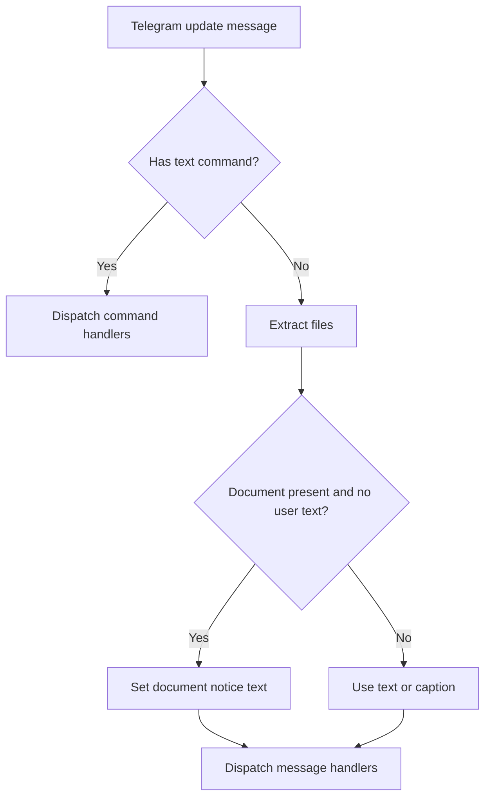

# Telegram Document Receive Fallback

## Summary

Telegram document updates now always include explicit text for agent handlers.  
When a document-only message arrives, the connector emits a `Document received: ...` notice, and keeps the download-failed suffix when storage fails.

## Behavior

- Successful document download with no text/caption: message contains `files` and `Document received: <name>.` text.
- Failed document download with no text/caption: message contains fallback text (`Document received ... (download failed).`).
- Existing text/caption behavior remains unchanged.

## Flow

