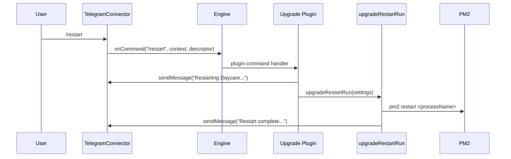

# Telegram restart command

This note documents the `/restart` command flow exposed by the Upgrade plugin.

- `/restart` is registered only when the Upgrade plugin is enabled.
- Restart uses the plugin's configured PM2 process name.
- The command does not run `npm install`; it performs restart only.
