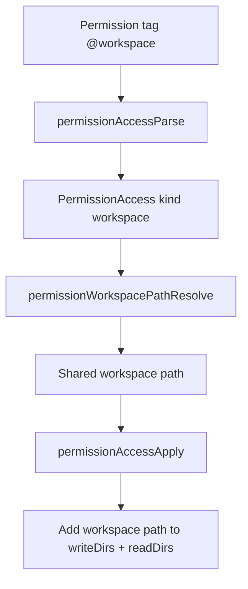
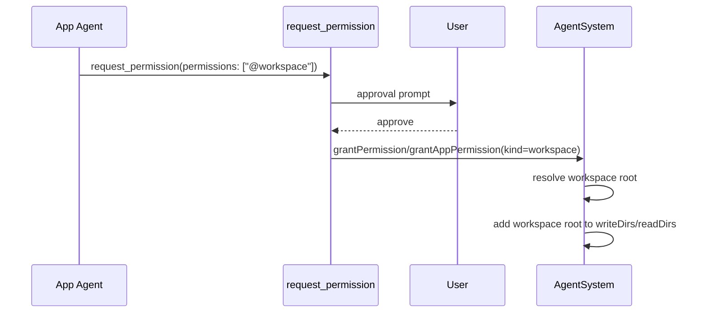

# Workspace Permission

Adds a new permission tag: `@workspace`.

`@workspace` grants write access to the shared workspace root (and corresponding read access).

## Default behavior

- Non-app agents (foreground/background/system/cron/heartbeat) effectively have `@workspace` by default because their permission set already includes shared workspace write access.
- App agents do **not** have `@workspace` by default.
- Apps can request `@workspace` explicitly via `request_permission`.

## Resolution model

`@workspace` resolves to the shared workspace root path using:

1. `permissions.workspaceDir` when present.
2. App working-dir shape fallback (`<workspace>/apps/<id>/data` -> `<workspace>`).
3. Closest ancestor from existing read/write permission roots.
4. Final fallback to `permissions.workingDir`.

## Permission flow

## App request flow

