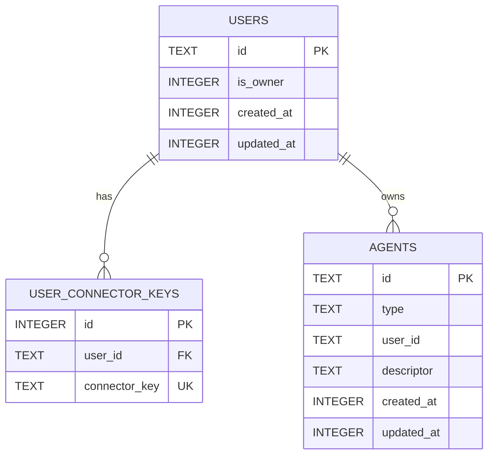
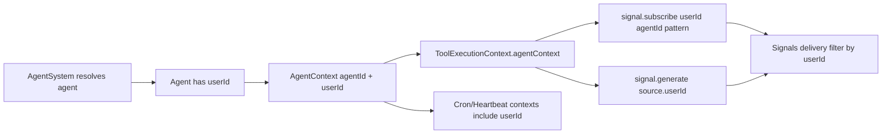

# Users DB and Agent Context

## Summary
This change introduces first-class users in storage and propagates user identity through runtime execution paths.

## Connector Key Format
User connector identities are normalized as:

```text
<connector>:<userId>
```

Examples:
- `telegram:12345`
- `whatsapp:+15551234567`

`channelId` is intentionally excluded from connector keys.

## Migration Logic
1. Create `users` and `user_connector_keys` tables with unique connector keys and a single-owner partial index.
2. Bootstrap users from existing `user` agents by connector key.
3. Assign earliest discovered user as owner.
4. If no `user` agents exist, create one owner user.
5. Add and backfill `agents.user_id` and enforce `NOT NULL`.
6. Add `idx_agents_user_id` for lookups.

## Schema Diagram


## Runtime Context Flow
`AgentContext(agentId, userId)` is now carried into tool execution and used for user-scoped signal behavior.



## Agent Ownership Rules
- `user` agents: resolved by connector key; user auto-created when unseen.
- `subagent` and `app` agents: inherit parent user when available.
- system/cron/heartbeat/permanent agents: owner user by default.

## Notes
- Signal subscriptions are now keyed as `userId::agentId::pattern`.
- Signal delivery checks user scope before dispatch.
