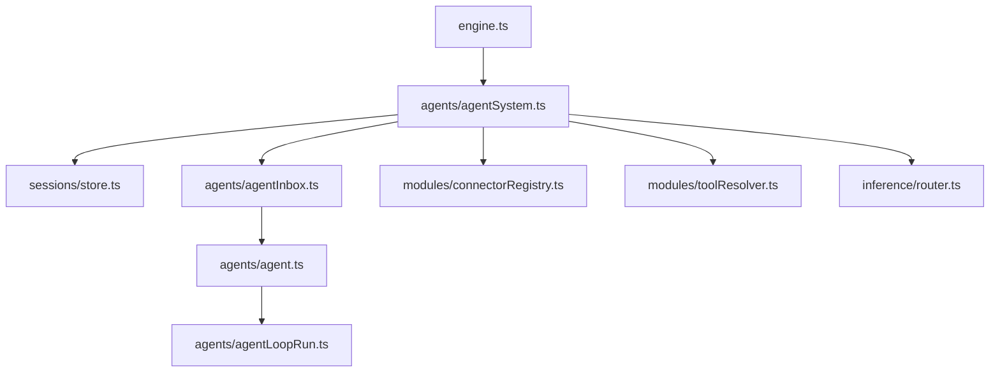

# AgentSystem

AgentSystem owns inbox-backed agent lifecycle:
- load agent sessions + create inboxes
- route posts by session id or descriptor
- spawn and message background agents
- expose session info for resets and status

AgentSystem boots in stages:
1. **load()** restores sessions + creates inboxes (no execution)
2. **enableScheduling()** lets the module registry enqueue messages
3. **start()** starts agent inbox loops

