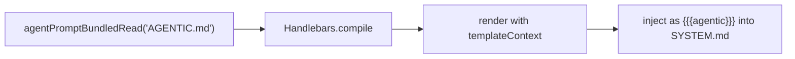

# Agentic Behavior Prompt

`AGENTIC.md` is a bundled prompt template that provides behavioral guidance for agents.
It covers autonomous operation, task decomposition, progressive refinement,
error recovery, context management, and execution bias.

The template uses Handlebars conditionals (`isForeground`) to tailor guidance
for foreground agents (coordination, subagent delegation) vs background agents
(pure execution, no questions).

## Rendering Pipeline

Follows the same two-stage pattern as `PERMISSIONS.md`:
1. Load and render `AGENTIC.md` with the shared template context (first Handlebars pass)
2. Inject the rendered result into `SYSTEM.md` via `{{{agentic}}}` (second Handlebars pass)

## Template Context

Uses `isForeground` from the shared template context to conditionally include
foreground-only sections (subagent delegation, context management).

## Location in System Prompt

Appears after Permission Requests and before the Agents section in `SYSTEM.md`.

## Sections

| Section | Audience | Purpose |
|---------|----------|---------|
| Autonomous Operation | Both (conditional) | Drive toward outcomes; foreground decomposes, background executes |
| Task Decomposition | Both (conditional) | Break goals into parallel steps; foreground uses subagents |
| Progressive Refinement | Both | Deliver early, iterate |
| Error Recovery | Both | Diagnose, try alternatives, exhaust options before escalating |
| Context Management | Foreground only | Keep context focused, offload to subagents |
| Execution Bias | Both | Act over deliberation |
