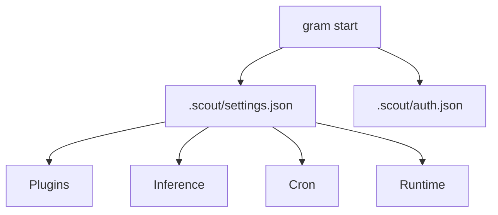

# Configuration

Grambot now reads from a single settings file plus the auth store.

- `.scout/settings.json` (or the path passed to `gram start --settings`)
- `.scout/auth.json` for credentials



## Sample `.scout/settings.json`
```json
{
  "engine": {
    "socketPath": ".scout/scout.sock",
    "dataDir": ".scout"
  },
  "plugins": [
    { "id": "telegram", "enabled": true, "config": { "polling": true } },
    { "id": "brave-search", "enabled": true },
    { "id": "gpt-image", "enabled": true },
    { "id": "nanobanana", "enabled": false, "config": { "endpoint": "https://api.example.com/images" } },
    { "id": "openai", "enabled": true }
  ],
  "inference": {
    "providers": [
      { "id": "openai", "model": "gpt-4o-mini" }
    ]
  },
  "cron": {
    "tasks": [
      {
        "id": "heartbeat",
        "everyMs": 60000,
        "message": "ping",
        "action": "send-message",
        "runOnStart": true,
        "channelId": "local",
        "source": "telegram"
      }
    ]
  },
  "runtime": {
    "pm2": {
      "processes": [
        {
          "name": "worker",
          "script": "dist/worker.js",
          "args": ["--mode", "job"],
          "autorestart": true
        }
      ]
    },
    "containers": {
      "connection": { "socketPath": "/var/run/docker.sock" },
      "containers": [{ "name": "redis", "action": "ensure-running" }]
    }
  },
  "memory": {
    "enabled": true,
    "maxEntries": 1000
  },
  "assistant": {
    "workspaceDir": "/Users/you/workspace/grambot-project",
    "containerWorkspacePath": "/workspace",
    "allowedDockerImages": ["node:22-alpine", "python:3.12-slim"],
    "allowedPm2Processes": ["worker", "api"]
  }
}
```

## `.scout/auth.json`
Credentials are stored per provider id:

```json
{
  "telegram": { "type": "token", "token": "..." },
  "brave-search": { "type": "apiKey", "apiKey": "..." },
  "openai": { "type": "apiKey", "apiKey": "..." },
  "openai": { "type": "apiKey", "apiKey": "..." },
  "gpt-image": { "type": "apiKey", "apiKey": "..." },
  "nanobanana": { "type": "apiKey", "apiKey": "..." }
}
```
