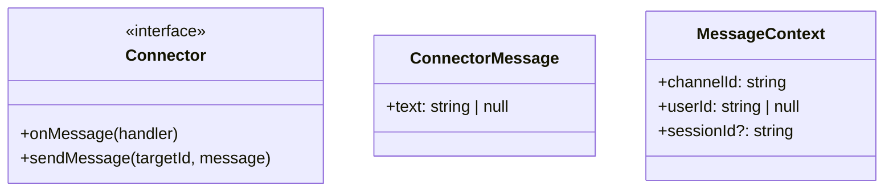
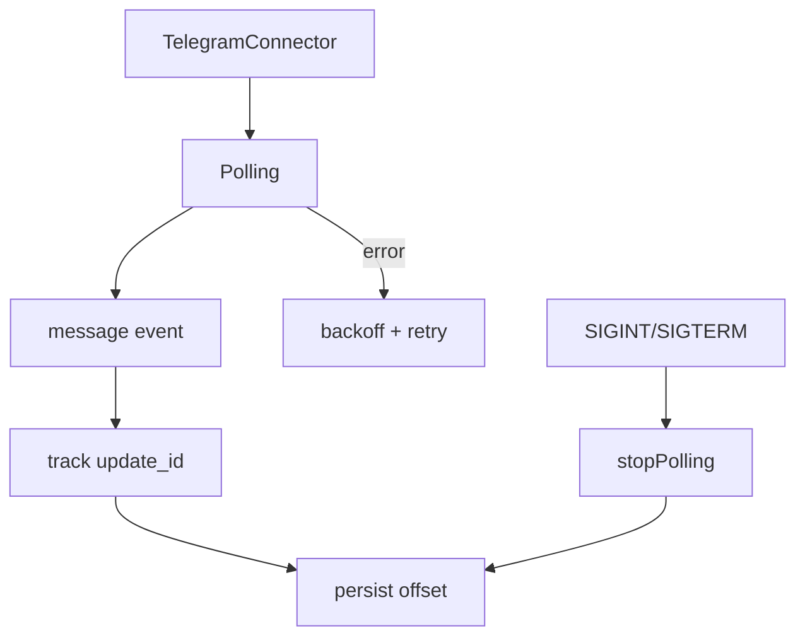
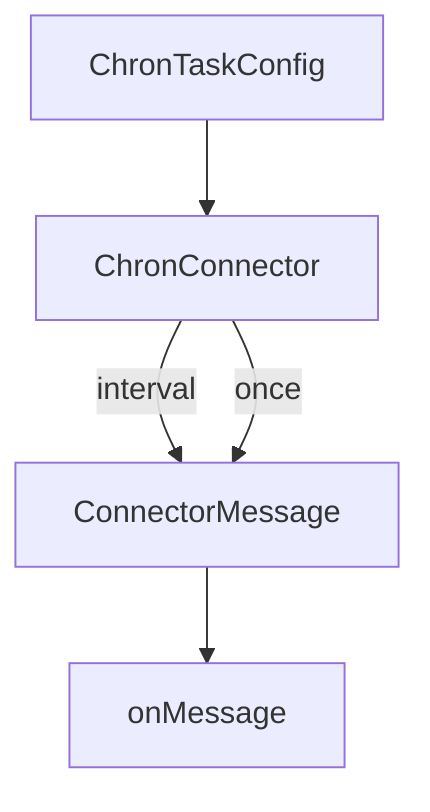

# Connectors

Connectors are the interface between Scout and external systems.

## Connector interface
Each connector exposes:
- `onMessage(handler)` to receive `ConnectorMessage` events.
- `sendMessage(targetId, message)` to respond.

Messages are normalized to:
```
{ text: string | null }
```



## Telegram connector
- Uses long polling by default.
- Persists `lastUpdateId` to `.scout/telegram-offset.json` for resume.
- Retries polling failures with exponential backoff and jitter.
- Handles SIGINT/SIGTERM and stops polling cleanly.



## Chron connector
Chron is a time-based connector that emits messages on a schedule.
- Tasks can be one-off (`once`) or interval (`everyMs`).
- `runOnStart` triggers a message immediately.
- This connector is exported but not wired into `start` yet (cron scheduler is used there).


