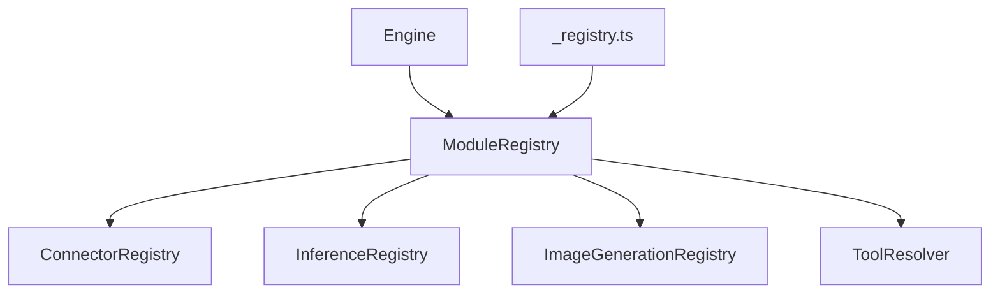

# Engine Modules Registry

The engine module registries now live under `sources/engine/modules/` and are exported through `_registry.ts` for shared imports. `ModuleRegistry` aggregates the registries and is exposed on the engine instance as `modules`.

