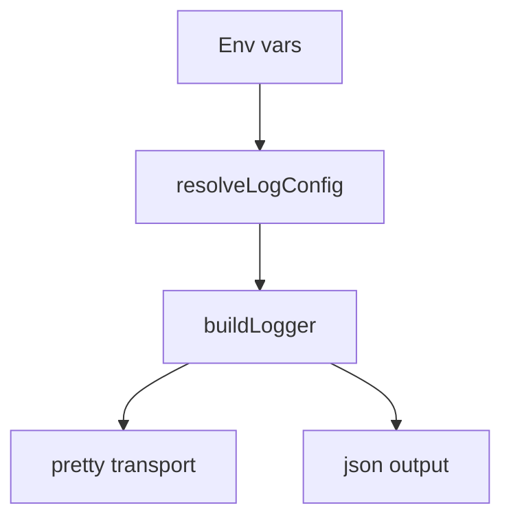

# Logging

Logging is centralized in `sources/log.ts` and uses Pino.

## Configuration
Environment variables:
- `SCOUT_LOG_LEVEL` / `LOG_LEVEL`
- `SCOUT_LOG_FORMAT` / `LOG_FORMAT` (`pretty` or `json`)
- `SCOUT_LOG_DEST` / `LOG_DEST` (`stdout`, `stderr`, or file path)
- `SCOUT_LOG_REDACT` (comma-separated paths)

Defaults:
- `pretty` format in TTY + non-production
- `json` otherwise
- redaction for `token`, `password`, `secret`, `apiKey` and dotted variants

