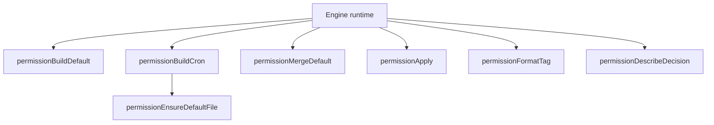

# Permissions

This document summarizes the permission helper functions extracted from the engine runtime.

## Helper roles

- `permissionBuildDefault`: create the initial session permissions from workspace + config paths.
- `permissionBuildCron`: build cron-specific permissions that inherit defaults.
- `permissionEnsureDefaultFile`: merge default read/write directories into a session.
- `permissionMergeDefault`: combine existing session permissions with defaults.
- `permissionApply`: apply an approved permission decision to a session.
- `permissionFormatTag`: format the `@web`/`@read`/`@write` tag used in logs.
- `permissionDescribeDecision`: human-readable label for permission decisions.
