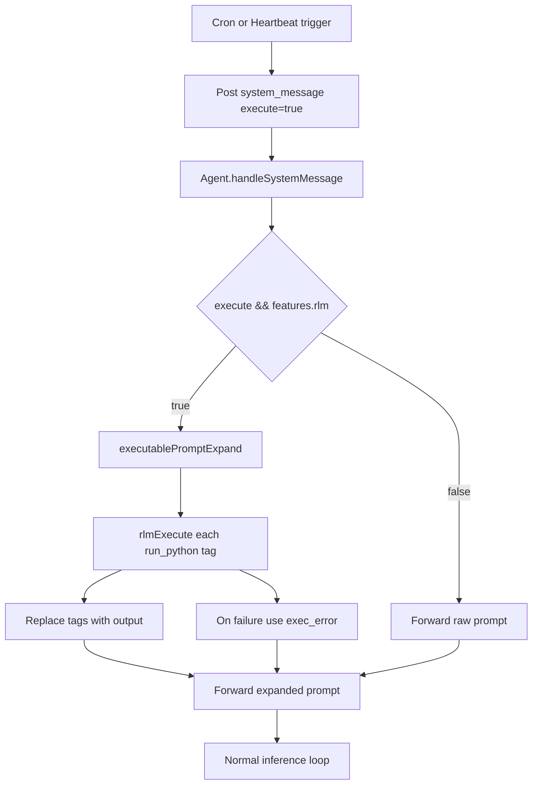

# Executable Prompts

## Overview
Add a preprocessing step that expands `<run_python>` tags embedded in cron/heartbeat prompts before they reach the LLM. When RLM is enabled, prompts containing `<run_python>...</run_python>` blocks are executed via the Monty Python VM (with full tool access), and the tag is replaced with the execution output (or an inline error on failure). This enables dynamic, data-driven prompts for scheduled tasks.

The existing `system_message` inbox item now carries an optional `execute` flag. Cron/heartbeat post `{ type: "system_message", execute: true }`; the agent expands `<run_python>` tags before normal system-message handling.

## Context
- **Cron flow**: `Crons.onTask()` → posts `{ type: "system_message", execute: true, origin: "cron" }`
- **Heartbeat flow**: `Heartbeats.onRun()` → batches prompts via `heartbeatPromptBuildBatch()` → posts `{ type: "system_message", execute: true, origin: "heartbeat" }`
- **RLM execution**: `rlmExecute()` in `sources/engine/modules/rlm/rlmExecute.ts` runs Monty Python code with full tool access
- **Tag extraction**: `tagExtractAll()` in `sources/util/tagExtract.ts` extracts content from XML-like tags
- **Feature gating**: `features.rlm` flag controls RLM availability; reused for executable prompts
- **Agent inbox types**: defined in `sources/engine/agents/ops/agentTypes.ts`

## Development Approach
- **Testing approach**: Regular (code first, then tests)
- Complete each task fully before moving to the next
- Make small, focused changes
- **CRITICAL: every task MUST include new/updated tests** for code changes in that task
- **CRITICAL: all tests must pass before starting next task**
- **CRITICAL: update this plan file when scope changes during implementation**
- Run tests after each change

## Testing Strategy
- **Unit tests**: required for every task
- Pure functions tested in isolation with vitest

## Progress Tracking
- Mark completed items with `[x]` immediately when done
- Add newly discovered tasks with ➕ prefix
- Document issues/blockers with ⚠️ prefix

## Implementation Steps

### Task 1: Add `execute` flag to `system_message`
- [x] Add optional `execute?: boolean` to `system_message` in `AgentInboxItem` (`agentTypes.ts`)
- [x] Keep existing `AgentInboxResult` shape (no new item type added)
- [x] Keep inbox dispatch and sleep handling unchanged (reuse existing `system_message` path)
- [x] Write tests for type definitions (`agentTypes.spec.ts`)
- [x] Run tests - must pass before next task

### Task 2: Create `executablePromptExpand` pure function
- [x] Create `sources/engine/modules/executablePrompts/executablePromptExpand.ts`
- [x] Function signature: `executablePromptExpand(prompt: string, context: ToolExecutionContext, toolResolver: ToolResolverApi): Promise<string>`
- [x] Use `tagExtractAll` to find all `<run_python>` blocks in the prompt
- [x] If no tags found, return prompt unchanged
- [x] For each tag: execute via `rlmExecute()` with full tool access, replace the tag block (open tag through close tag) with the output
- [x] On execution failure: replace the tag block with `<exec_error>Error message here</exec_error>`
- [x] Single-pass expansion only (no recursion)
- [x] Write tests for: no tags (passthrough), single tag expansion, multiple tags, error replacement
- [x] Run tests - must pass before next task

### Task 3: Create `executablePromptTagReplace` helper
- [x] Create `sources/engine/modules/executablePrompts/executablePromptTagReplace.ts`
- [x] Function: takes prompt string, tag index/match info, and replacement text; returns new prompt with that tag block replaced
- [x] Must handle replacement without shifting indices of subsequent tags (process from last to first, or rebuild string)
- [x] Write tests for single replacement, multiple sequential replacements, edge cases (empty replacement, multiline tags)
- [x] Run tests - must pass before next task

### Task 4: Wire `system_message.execute` handling in agent
- [x] Reuse `handleSystemMessage(item)` in `agent.ts` and gate expansion on `item.execute`
- [x] Check `features.rlm` flag; if disabled, skip expansion and forward raw prompt as system message
- [x] If RLM enabled: call `executablePromptExpand()` to expand prompt
- [x] Build execution context (same pattern as `agentLoopRun` tool execution context setup)
- [x] Continue normal `system_message` flow after expansion
- [x] Log expansion: tag count found, execution time, any errors
- [x] Write tests for: RLM disabled passthrough, RLM enabled expansion, error handling
- [x] Run tests - must pass before next task

### Task 5: Update Crons to post executable `system_message`
- [x] Modify `crons.ts` `onTask` callback to post `{ type: "system_message", execute: true, origin: "cron", ... }`
- [x] Remove signal construction from cron task delivery
- [x] Preserve cron task metadata (`taskId`, `taskUid`, `taskName`) in prompt preamble
- [x] Write tests for cron posting executable system messages
- [x] Run tests - must pass before next task

### Task 6: Update Heartbeats to post executable `system_message`
- [x] Modify `heartbeats.ts` `onRun` callback to post `{ type: "system_message", execute: true, origin: "heartbeat", ... }`
- [x] Preserve heartbeat task metadata in the prompt (already handled by `heartbeatPromptBuildBatch`)
- [x] Write tests for heartbeat posting executable system messages
- [x] Run tests - must pass before next task

### Task 7: Add README for executablePrompts module
- [x] Create `sources/engine/modules/executablePrompts/README.md`
- [x] Document: purpose, `<run_python>` tag format, expansion rules, error handling, RLM dependency
- [x] Include example prompt with `<run_python>` tag and expected expansion

### Task 8: Verify acceptance criteria
- [x] Verify `<run_python>` tags in cron prompts are expanded before LLM sees them
- [x] Verify `<run_python>` tags in heartbeat prompts are expanded before LLM sees them
- [x] Verify errors produce inline `<exec_error>` blocks
- [x] Verify feature is gated by `features.rlm`
- [x] Verify prompts without `<run_python>` tags pass through unchanged
- [x] Run full test suite (unit tests)
- [x] Run linter
- ⚠️ Biome reports existing repository warnings outside this scope; no new lint errors were introduced by this change.

### Task 9: [Final] Update documentation
- [x] Update `doc/PLUGINS.md` if executable prompts affect plugin API (no plugin API impact; no change needed)
- [x] Add mermaid diagram to plan doc showing the execution flow

## Technical Details

### Updated System Message Shape
```typescript
// In agentTypes.ts
{
      type: "system_message";
      text: string;
      origin?: string;
      execute?: boolean;
      context?: MessageContext;
  }
```

### Expansion Flow


### Tag Replacement Example
```
Input prompt:
"Check status: <run_python>
result = get_system_status()
print(result)
</run_python> and report findings."

Expanded prompt (success):
"Check status: {"cpu": 45, "memory": 72} and report findings."

Expanded prompt (failure):
"Check status: <exec_error>RuntimeError: get_system_status not available</exec_error> and report findings."
```

## Post-Completion

**Manual verification:**
- Test with a real cron task containing `<run_python>` tags
- Verify tool access works within executable prompt context
- Test with heartbeat batch containing mixed executable/plain prompts
