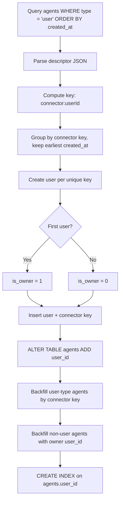
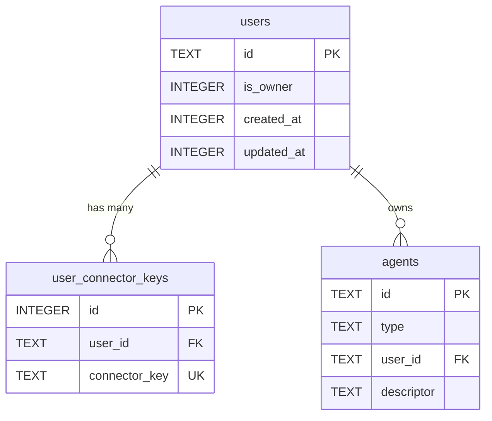

# Add Users to Database

## Overview
Add a `users` table and `user_connector_keys` table to SQLite storage, then add a `user_id` foreign key to the `agents` table so every agent belongs to a user. Introduce a readonly `AgentContext` class carrying `agentId` + `userId` to propagate user identity through tools, signals, and tasks. Scope signal subscriptions to userId.

**Problem**: No concept of "user" exists in the database. Connector identities (Telegram UID, WhatsApp phone) are embedded in agent descriptors with no entity linking them. Signals, cron, and heartbeats are global with no user isolation.

**Key benefits**:
- Every agent has a known owner (user_id NOT NULL)
- Connector identities normalized with DB-level uniqueness
- Single owner enforced at schema level (partial unique index)
- `AgentContext` provides consistent userId propagation to tools, signals, tasks
- Signals scoped per-user

## Context (from discovery)

### Files/components involved
- `sources/storage/migrations/` — migration system (transaction-wrapped, recorded in `_migrations`)
- `sources/storage/migrations/_migrations.ts` — migration registry
- `sources/storage/databaseTypes.ts` — DB row types and parsed record types
- `sources/storage/agentDb*.ts` — agent CRUD pattern (open db, operate, close)
- `sources/storage/databaseOpenEnsured.ts` — opens DB and runs migrations
- `sources/engine/agents/ops/agentDescriptorTypes.ts` — `AgentDescriptor` union
- `sources/engine/agents/agentSystem.ts` — agent resolution, signal delivery, subagent creation
- `sources/engine/modules/tools/types.ts` — `ToolExecutionContext` (what tools receive)
- `sources/engine/signals/signalTypes.ts` — `SignalSubscription` (currently agentId-scoped)
- `sources/engine/signals/signals.ts` — `Signals` facade (subscribe, generate, deliver)
- `sources/engine/cron/cronTypes.ts` — `CronTaskContext` and `CronTaskDefinition`
- `sources/engine/heartbeat/heartbeats.ts` — heartbeat scheduling
- `sources/engine/apps/appExecute.ts` — app/subagent creation (inherits parentAgentId)
- `sources/types.ts` — central type re-exports

### Existing patterns
- Migrations: `{ name: string, up(db): void }` in `sources/storage/migrations/`
- DB access: `databaseOpenEnsured(config.dbPath)` → operate → `db.close()` in finally
- Row types: `DatabaseXxxRow` (raw SQL columns) + `XxxDbRecord` (parsed TS objects)
- Parse layer: `xxxDbParse()` converts raw rows to typed records
- IDs: cuid2 via `createId()` from `@paralleldrive/cuid2`
- Timestamps: unix ms via `Date.now()`

### Connector key derivation
From `AgentDescriptor { type: "user"; connector: string; userId: string; channelId: string }`:
- Connector key = `${connector}:${userId}` (e.g., `telegram:12345`)
- `channelId` is NOT part of the key — a user has one identity per connector regardless of channel

### Agent-to-user assignment rules
- **User-type agents**: matched to user by connector key
- **Subagent/app agents**: inherit parent agent's userId
- **Cron/system/heartbeat/permanent agents**: assigned to owner during migration (each user gets their own at runtime)
- **On demand**: when a new connector identity arrives at runtime, auto-create a user

## Development Approach
- **Testing approach**: Regular (code first, then tests)
- Complete each task fully before moving to the next
- Make small, focused changes
- **CRITICAL: every task MUST include new/updated tests**
- **CRITICAL: all tests must pass before starting next task**
- **CRITICAL: update this plan file when scope changes during implementation**

## Testing Strategy
- **Unit tests**: required for every task
- Pure functions get dedicated `*.spec.ts` files
- Test both success and error scenarios
- Use in-memory SQLite (`:memory:`) or temp dirs for DB tests

## Progress Tracking
- Mark completed items with `[x]` immediately when done
- Add newly discovered tasks with `➕` prefix
- Document issues/blockers with `⚠️` prefix

## Implementation Steps

### Task 1: Create migration — add users and user_connector_keys tables
Add new migration file that creates the two tables with constraints and indexes.

- [x] Create `sources/storage/migrations/20260220_add_users.ts`:
  - `users` table: `id TEXT PRIMARY KEY`, `is_owner INTEGER NOT NULL DEFAULT 0`, `created_at INTEGER NOT NULL`, `updated_at INTEGER NOT NULL`
  - `user_connector_keys` table: `id INTEGER PRIMARY KEY AUTOINCREMENT`, `user_id TEXT NOT NULL REFERENCES users(id) ON DELETE CASCADE`, `connector_key TEXT NOT NULL UNIQUE`
  - Index: `idx_user_connector_keys_user_id ON user_connector_keys(user_id)`
  - Partial unique index: `CREATE UNIQUE INDEX idx_users_single_owner ON users(is_owner) WHERE is_owner = 1`
- [x] Register migration in `_migrations.ts`
- [x] Write test: migration creates tables with correct columns
- [x] Write test: UNIQUE constraint on `connector_key` rejects duplicates
- [x] Write test: partial unique index on `is_owner` allows only one owner
- [x] Run tests — must pass before next task

### Task 2: Create data migration — bootstrap users from agents, add user_id to agents
Scan agent descriptors to create user records, then add `user_id` column to agents and backfill.

- [x] Create `sources/storage/migrations/20260220_users_bootstrap.ts`:
  - Query all agents with `type = 'user'`, ordered by `created_at ASC`
  - Parse each descriptor JSON to extract `connector` and `userId`
  - Compute connector key as `${connector}:${userId}`
  - Deduplicate: group agents by connector key (multiple agents can share same connector identity across channels)
  - For each unique connector key (ordered by earliest `created_at`): create a user with `createId()`, insert into `users` and `user_connector_keys`
  - First user (earliest `created_at`) gets `is_owner = 1`, all others get `0`
  - If no user-type agents exist: create a single owner user with no connector keys
  - Add `user_id TEXT` column to agents (nullable initially)
  - Backfill user-type agents: `UPDATE agents SET user_id = ? WHERE type = 'user' AND ...` matching by connector key
  - Backfill non-user agents (cron, system, subagent, app, permanent): assign owner's user_id
  - Alter column to NOT NULL: SQLite doesn't support ALTER COLUMN, so verify all rows have user_id, then create new table with NOT NULL constraint, copy data, drop old, rename (or just ensure all rows are filled — SQLite allows CHECK constraint addition)
  - Add foreign key: not possible via ALTER in SQLite, but the NOT NULL + application-level enforcement is sufficient. Add an index on `user_id`.
  - `CREATE INDEX idx_agents_user_id ON agents(user_id)`
- [x] Register migration in `_migrations.ts` (after the schema migration)
- [x] Write test: empty agents table creates one owner user, agents get user_id
- [x] Write test: two agents with same connector identity → one user, both agents get same user_id
- [x] Write test: two agents with different connectors → two users, earliest is owner
- [x] Write test: non-user agents (cron, system) get owner's user_id
- [x] Write test: subagent gets owner's user_id (parent resolution happens at runtime, migration uses owner)
- [x] Run tests — must pass before next task

### Task 3: Add user DB types and parse functions
Add TypeScript types for user rows and parsed records following the existing pattern.

- [x] Add to `sources/storage/databaseTypes.ts`:
  - `DatabaseUserRow`: `{ id: string; is_owner: number; created_at: number; updated_at: number }`
  - `DatabaseUserConnectorKeyRow`: `{ id: number; user_id: string; connector_key: string }`
  - `UserDbRecord`: `{ id: string; isOwner: boolean; createdAt: number; updatedAt: number }`
  - `UserConnectorKeyDbRecord`: `{ id: number; userId: string; connectorKey: string }`
- [x] Update `DatabaseAgentRow` to include `user_id: string`
- [x] Update `AgentDbRecord` to include `userId: string`
- [x] Update `agentDbParse` to map `user_id` → `userId`
- [x] Update `agentDbWrite` to persist `userId`
- [x] Create `sources/storage/userDbParse.ts` — converts `DatabaseUserRow` → `UserDbRecord`
- [x] Write test for `userDbParse` (is_owner 0/1 → boolean conversion)
- [x] Write test for updated `agentDbParse` (userId field)
- [x] Update existing `agentDb.spec.ts` to include userId in test fixtures
- [x] Run tests — must pass before next task

### Task 4: Add user DB CRUD operations
Create read/write/list functions for users following the agentDb pattern.

- [x] Create `sources/storage/userDbRead.ts` — reads one user by id, joins connector keys
- [x] Create `sources/storage/userDbWrite.ts` — upserts one user row
- [x] Create `sources/storage/userDbList.ts` — lists all users with their connector keys
- [x] Create `sources/storage/userDbReadByConnectorKey.ts` — finds user by connector key string
- [x] Create `sources/storage/userDbConnectorKeyAdd.ts` — adds a connector key to a user
- [x] Write test: roundtrip write/read a user
- [x] Write test: list multiple users
- [x] Write test: read by connector key returns correct user
- [x] Write test: adding duplicate connector key fails (UNIQUE constraint)
- [x] Run tests — must pass before next task

### Task 5: Create AgentContext readonly class
Introduce a lightweight context object that carries agentId + userId through the system.

- [x] Create `sources/engine/agents/agentContext.ts`:
  ```typescript
  /**
   * Readonly context carrying agent and user identity.
   * Passed to tools, signals, and tasks for user-scoped operations.
   */
  export class AgentContext {
    readonly agentId: string;
    readonly userId: string;
    constructor(agentId: string, userId: string) {
      this.agentId = agentId;
      this.userId = userId;
    }
  }
  ```
- [x] Export `AgentContext` from `sources/types.ts`
- [x] Write test: AgentContext is readonly (properties set in constructor, cannot be reassigned)
- [x] Run tests — must pass before next task

### Task 6: Wire AgentContext into ToolExecutionContext
Replace ad-hoc agent identity passing with AgentContext in tool execution.

- [x] Add `agentContext: AgentContext` field to `ToolExecutionContext` in `sources/engine/modules/tools/types.ts`
- [x] Update all call sites that build `ToolExecutionContext` to include `agentContext`
- [x] Update signal tool (`signal.ts`) to use `agentContext.userId` for source tracking
- [x] Verify typecheck passes — all ToolExecutionContext constructors updated
- [x] Write test: tool execution context carries correct agentId and userId
- [x] Run tests — must pass before next task

### Task 7: Scope signal subscriptions to userId
Add userId to signal subscriptions so signals are delivered only to the subscribing user's agents.

- [x] Add `userId: string` to `SignalSubscription` in `sources/engine/signals/signalTypes.ts`
- [x] Update subscription key format in `Signals` facade from `agentId::pattern` to `userId::agentId::pattern`
- [x] Update `Signals.subscribe()` to require userId
- [x] Update `Signals.signalSubscriptionsMatch()` to filter by userId when delivering signals
- [x] Update `AgentSystem.signalDeliver()` — subscriptions already carry userId
- [x] Update all call sites that subscribe to signals to pass userId
- [x] Write test: signal delivered only to matching userId's agents
- [x] Write test: signal NOT delivered to different userId's agents with same pattern
- [x] Run tests — must pass before next task

### Task 8: Propagate userId through cron and heartbeat contexts
Add userId to cron task context and heartbeat execution so scheduled work is user-scoped.

- [x] Add `userId: string` to `CronTaskContext` in `sources/engine/cron/cronTypes.ts`
- [x] Add `userId?: string` to `CronTaskDefinition` for user-owned cron jobs
- [x] Update heartbeat execution in `heartbeats.ts` to resolve userId from agent
- [x] Update cron scheduling to pass userId when posting to agents
- [x] Write test: cron task context includes correct userId
- [x] Run tests — must pass before next task

### Task 9: Wire user resolution into AgentSystem
When resolving agent entries, look up or create users on demand.

- [x] Update `AgentSystem.resolveEntry()` for user-type descriptors:
  - Compute connector key from descriptor
  - Look up user by connector key via `userDbReadByConnectorKey`
  - If not found: create user on demand via `userDbWrite` + `userDbConnectorKeyAdd`
  - Set `userId` on the agent record
- [x] Update subagent/app creation to inherit parent's userId
- [x] Update `Agent.create()` to accept userId
- [x] Write test: new connector identity auto-creates user
- [x] Write test: known connector identity reuses existing user
- [x] Write test: subagent inherits parent's userId
- [x] Run tests — must pass before next task

### Task 10: Export types from @/types
Add all new types to the central type index.

- [x] Export `UserDbRecord`, `UserConnectorKeyDbRecord`, `AgentContext` from `sources/types.ts`
- [x] Verify no circular imports with `yarn typecheck`
- [x] Run tests — must pass before next task

### Task 11: Verify acceptance criteria
- [x] Verify: `users` table created with correct schema (id, is_owner, created_at, updated_at)
- [x] Verify: `user_connector_keys` table created with UNIQUE on connector_key
- [x] Verify: partial unique index enforces single owner
- [x] Verify: `agents.user_id` is NOT NULL and populated for all agents
- [x] Verify: data migration correctly bootstraps users from agents
- [x] Verify: earliest agent's user gets is_owner = true
- [x] Verify: non-user agents assigned to owner
- [x] Verify: AgentContext available in ToolExecutionContext
- [x] Verify: signal subscriptions scoped to userId
- [x] Verify: new connector identity auto-creates user at runtime
- [x] Verify: subagents inherit parent's userId
- [x] Run full test suite (`yarn test`)
- [x] Run linter/typecheck (`yarn typecheck`)

### Task 12: [Final] Update documentation
- [x] Add mermaid diagrams of user tables and context flow to `docs/`
- [x] Document the connector key format, migration logic, and AgentContext usage

## Technical Details

### Schema

```sql
-- New tables
CREATE TABLE users (
  id TEXT PRIMARY KEY,
  is_owner INTEGER NOT NULL DEFAULT 0,
  created_at INTEGER NOT NULL,
  updated_at INTEGER NOT NULL
);

CREATE UNIQUE INDEX idx_users_single_owner ON users(is_owner) WHERE is_owner = 1;

CREATE TABLE user_connector_keys (
  id INTEGER PRIMARY KEY AUTOINCREMENT,
  user_id TEXT NOT NULL REFERENCES users(id) ON DELETE CASCADE,
  connector_key TEXT NOT NULL UNIQUE
);

CREATE INDEX idx_user_connector_keys_user_id ON user_connector_keys(user_id);

-- Added column on existing table
ALTER TABLE agents ADD COLUMN user_id TEXT NOT NULL DEFAULT '';
CREATE INDEX idx_agents_user_id ON agents(user_id);
```

### Connector Key Format
```
${connector}:${userId}
```
Examples: `telegram:12345`, `whatsapp:15551234567`

### AgentContext Class
```typescript
class AgentContext {
  readonly agentId: string;
  readonly userId: string;
  constructor(agentId: string, userId: string) {
    this.agentId = agentId;
    this.userId = userId;
  }
}
```

Passed through: `ToolExecutionContext`, `SignalSubscription`, `CronTaskContext`, heartbeat execution.

### Data Migration Flow


### ER Diagram


### Agent-to-User Assignment
| Agent type | Migration assignment | Runtime assignment |
|------------|---------------------|--------------------|
| user | Matched by connector key | Matched by connector key (create on demand) |
| subagent | Owner's user_id | Inherit parent's userId |
| app | Owner's user_id | Inherit parent's userId |
| cron | Owner's user_id | Per-user at creation |
| system | Owner's user_id | Per-user at creation |
| permanent | Owner's user_id | Per-user at creation |

## Post-Completion

**Future work** (not in scope):
- Per-user home directories and permission zones (see `multiuser-home-directories.md`)
- User management CLI commands
- Per-user cron/heartbeat file storage
- User deletion / data export
