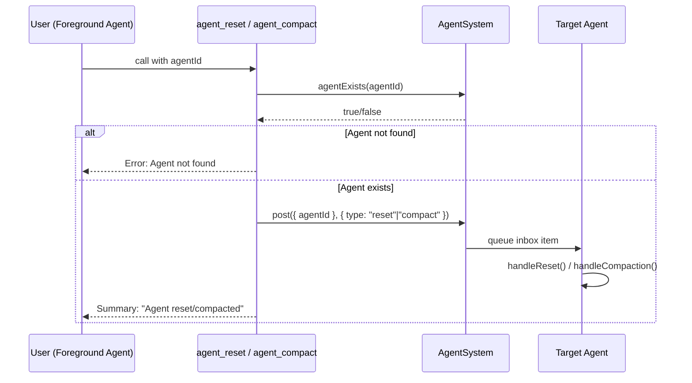

# Agent Session Control Tools

## Overview
Introduce two new core tools — `agent_reset` and `agent_compact` — that allow frontend agents to reset or trigger compaction on any agent session by ID. This gives users (via their foreground chat agent) the ability to manage agent sessions without relying on REST endpoints or connector commands.

- **Problem**: Currently, resetting or compacting an agent session is only possible via internal inbox items posted by the engine itself (connector `/reset` and `/compact` commands) or via the REST IPC endpoint. There is no way for a frontend agent to programmatically manage other agents' sessions through the tool system.
- **Key benefit**: Frontend agents can proactively manage context pressure — resetting stuck agents, compacting bloated sessions, or clearing agent state as part of a workflow.
- **Restriction**: Only foreground (user-type) agents can see and use these tools. Background agents are denied via `toolListContextBuild` filtering.
- **Restriction**: Tools cannot target the caller's own agent id (self reset/compaction is blocked).

## Context
- **Inbox items already exist**: `AgentInboxItem` includes `{ type: "reset", message?: string }` and `{ type: "compact" }` (`agentTypes.ts:148-156`)
- **Agent class handles them**: `handleReset()` (agent.ts:638-683) and `handleCompaction()` (agent.ts:685-704)
- **AgentSystem.post()** accepts `AgentPostTarget` and any `AgentInboxItem` (`agentSystem.ts:237`)
- **Existing pattern**: `background.ts` defines `start_background_agent` and `send_agent_message` tools that use `toolContext.agentSystem.post()`
- **Filtering pattern**: `toolListContextBuild.ts` uses `BACKGROUND_TOOL_DENYLIST` set to hide tools from background agents

## Development Approach
- **Testing approach**: Regular (code first, then tests)
- Complete each task fully before moving to the next
- Make small, focused changes
- **CRITICAL: every task MUST include new/updated tests**
- **CRITICAL: all tests must pass before starting next task**
- **CRITICAL: update this plan file when scope changes during implementation**

## Testing Strategy
- **Unit tests**: required for every task
- Tool execute functions tested with mock `toolContext` and `agentSystem`
- `toolListContextBuild` filtering tested for new tool names

## Progress Tracking
- Mark completed items with `[x]` immediately when done
- Add newly discovered tasks with ➕ prefix
- Document issues/blockers with ⚠️ prefix
- ⚠️ `yarn test` currently fails in pre-existing upgrade plugin tests (`sources/plugins/upgrade/plugin.spec.ts`), unrelated to agent session control tool changes.
- ➕ Added guardrail: prohibit self reset/compaction in tool execute paths.

## Implementation Steps

### Task 1: Create `agentResetTool.ts` — the agent_reset tool
- [x] Create `packages/daycare/sources/engine/modules/tools/agentResetTool.ts`
- [x] Define input schema: required `agentId: string`, optional `message: string`
- [x] Define result schema and `ToolResultContract` (reuse simple summary pattern from `background.ts`)
- [x] Implement `agentResetToolBuild()` returning `ToolDefinition`
- [x] In `execute`: validate agent exists via `toolContext.agentSystem.agentExists(agentId)`, then post `{ type: "reset", message }` via `toolContext.agentSystem.post({ agentId }, item)`
- [x] Write tests in `agentResetTool.spec.ts` — success case, agent-not-found error, optional message passing
- [x] Run tests — must pass before next task

### Task 2: Create `agentCompactTool.ts` — the agent_compact tool
- [x] Create `packages/daycare/sources/engine/modules/tools/agentCompactTool.ts`
- [x] Define input schema: required `agentId: string`
- [x] Define result schema and `ToolResultContract`
- [x] Implement `agentCompactToolBuild()` returning `ToolDefinition`
- [x] In `execute`: validate agent exists, then post `{ type: "compact" }` via `toolContext.agentSystem.post({ agentId }, item)`
- [x] Write tests in `agentCompactTool.spec.ts` — success case, agent-not-found error
- [x] Run tests — must pass before next task

### Task 3: Register tools and restrict to foreground agents
- [x] Import both builders in `engine.ts` and register with `this.modules.tools.register("core", ...)`  alongside other core tools (~line 380)
- [x] Add `"agent_reset"` and `"agent_compact"` to `BACKGROUND_TOOL_DENYLIST` in `toolListContextBuild.ts` so background agents cannot see them
- [x] Write tests for `toolListContextBuild` filtering — verify both tools are excluded for background agents and included for foreground agents
- [x] Run tests — must pass before next task

### Task 4: Verify acceptance criteria
- [x] Verify `agent_reset` tool works with and without optional message
- [x] Verify `agent_compact` tool posts correct inbox item
- [x] Verify both tools are hidden from background agents
- [x] Verify both tools are visible to foreground agents
- [ ] Run full test suite (`yarn test`)
- [x] Run type checker (`yarn typecheck`)

### Task 5: Update documentation
- [x] Update `doc/` if tool inventory docs exist
- [x] Add debug log line in `engine.ts` registration comment (~line 416) listing new tools

## Technical Details

### Input/Output Schemas

**agent_reset**:
```typescript
// Input
Type.Object({
  agentId: Type.String({ minLength: 1 }),
  message: Type.Optional(Type.String({ minLength: 1 }))
}, { additionalProperties: false })

// Output — simple summary
Type.Object({
  summary: Type.String(),
  targetAgentId: Type.String()
}, { additionalProperties: false })
```

**agent_compact**:
```typescript
// Input
Type.Object({
  agentId: Type.String({ minLength: 1 })
}, { additionalProperties: false })

// Output — simple summary
Type.Object({
  summary: Type.String(),
  targetAgentId: Type.String()
}, { additionalProperties: false })
```

### Processing Flow



### Filtering

Both tools are added to `BACKGROUND_TOOL_DENYLIST` in `toolListContextBuild.ts`, following the same pattern as `set_reaction` and `send_file`. Only `"user"` descriptor agents (foreground) will see them in their tool list.

## Post-Completion

**Manual verification**:
- Test via a real foreground chat session: call `agent_reset` on a subagent and verify its context is cleared
- Test `agent_compact` on a subagent with significant context and verify compaction log is created
- Verify background/cron agents do not see the tools in their tool list
