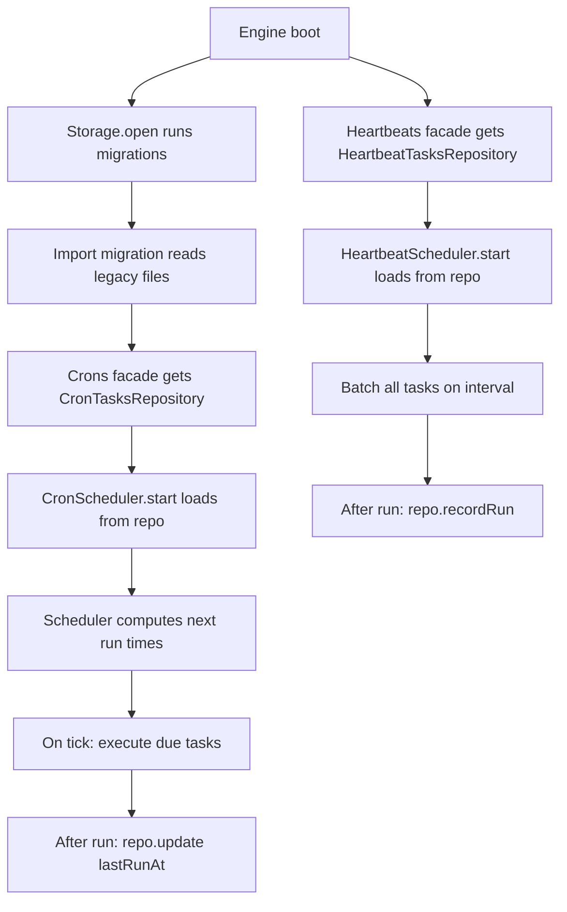

# Cron & Heartbeat Database Migration

## Overview
Move cron tasks and heartbeat tasks from file-based storage to SQLite. Two separate tables (`tasks_cron`, `tasks_heartbeat`) replace the filesystem stores. Cron/heartbeat no longer have their own memory — agents have their own memory now. Drop cron `MEMORY.md`, `files/` workspace, and memory tools. Write an import migration to preserve existing file-based tasks.

## Context
- **Cron store** (`engine/cron/ops/cronStore.ts`): reads/writes `<configDir>/cron/<task-id>/TASK.md`, `MEMORY.md`, `STATE.json`, `files/`
- **Heartbeat store** (`engine/heartbeat/ops/heartbeatStore.ts`): reads/writes `<configDir>/heartbeat/<task-id>.md`, `.heartbeat-state.json`
- **Database layer** (`storage/`): SQLite with repository pattern, write-through caching (`AgentsRepository`), migration framework
- **Cron memory tools**: `cron_read_memory`, `cron_write_memory` — to be removed
- **Cron `files/` workspace**: to be removed (agents use their own home)
- **Heartbeat batch execution**: kept as-is (all heartbeat tasks fire together)
- **Tools remain engine-level** (not plugins)

## Development Approach
- **Testing approach**: Regular (code first, then tests)
- Complete each task fully before moving to the next
- Make small, focused changes
- **CRITICAL: every task MUST include new/updated tests**
- **CRITICAL: all tests must pass before starting next task**
- **CRITICAL: update this plan file when scope changes during implementation**

## Progress Tracking
- Mark completed items with `[x]` immediately when done
- Add newly discovered tasks with ➕ prefix
- Document issues/blockers with ⚠️ prefix

## Implementation Steps

### Task 1: Add DB types for cron and heartbeat tasks
- [x] Add `DatabaseCronTaskRow` and `CronTaskDbRecord` to `storage/databaseTypes.ts`
  - Columns: `id TEXT PK`, `task_uid TEXT NOT NULL UNIQUE`, `user_id TEXT`, `name TEXT NOT NULL`, `description TEXT`, `schedule TEXT NOT NULL`, `prompt TEXT NOT NULL`, `agent_id TEXT`, `gate TEXT` (JSON), `enabled INTEGER NOT NULL DEFAULT 1`, `delete_after_run INTEGER NOT NULL DEFAULT 0`, `last_run_at INTEGER`, `created_at INTEGER NOT NULL`, `updated_at INTEGER NOT NULL`
- [x] Add `DatabaseHeartbeatTaskRow` and `HeartbeatTaskDbRecord` to `storage/databaseTypes.ts`
  - Columns: `id TEXT PK`, `title TEXT NOT NULL`, `prompt TEXT NOT NULL`, `gate TEXT` (JSON), `last_run_at INTEGER`, `created_at INTEGER NOT NULL`, `updated_at INTEGER NOT NULL`
- [x] No tests needed (pure type definitions)

### Task 2: Create `CronTasksRepository` with write-through cache
- [x] Create `storage/cronTasksRepository.ts` following `AgentsRepository` pattern
  - Write-through cache with `AsyncLock` per task
  - Methods: `findById`, `findMany`, `create`, `update`, `delete`
  - Parse/serialize `gate` as JSON
  - `findMany` returns only enabled tasks by default (add `includeDisabled` option)
- [x] Write tests for `CronTasksRepository` CRUD operations in `storage/cronTasksRepository.spec.ts`
  - Test create, findById, findMany, update, delete
  - Test JSON round-tripping of `gate` field
  - Test cache behavior (read after write returns correct data)
- [x] Run tests — must pass before next task

### Task 3: Create `HeartbeatTasksRepository` with write-through cache
- [x] Create `storage/heartbeatTasksRepository.ts` following same pattern
  - Methods: `findById`, `findMany`, `create`, `update`, `delete`, `recordRun` (updates `last_run_at` on all tasks)
- [x] Write tests for `HeartbeatTasksRepository` in `storage/heartbeatTasksRepository.spec.ts`
- [x] Run tests — must pass before next task

### Task 4: Add migration for `tasks_cron` and `tasks_heartbeat` tables
- [x] Create `storage/migrations/20260220_add_tasks.ts`
  - `CREATE TABLE tasks_cron (...)` with columns from Task 1
  - `CREATE TABLE tasks_heartbeat (...)` with columns from Task 1
- [x] Register in `storage/migrations/_migrations.ts`
- [x] Run tests — must pass before next task

### Task 5: Add import migration for existing file-based tasks
- [x] Create `storage/migrations/20260220_import_tasks.ts`
  - Read existing cron tasks from `<configDir>/cron/` directories (sync FS reads, like `20260219_import_files.ts`)
  - Read existing heartbeat tasks from `<configDir>/heartbeat/*.md` files
  - Insert into new tables; skip `MEMORY.md` and `files/` — they are dropped
  - Parse frontmatter using the same logic as `CronStore.loadTask` / `HeartbeatStore.loadTask`
  - Use `databasePathResolve` to locate `configDir` relative to DB path
- [x] Register in `storage/migrations/_migrations.ts`
- [x] Write test verifying import reads legacy files and inserts rows in `storage/migrations/20260220_import_tasks.spec.ts`
- [x] Run tests — must pass before next task

### Task 6: Wire repositories into `Storage` facade
- [x] Add `cronTasks: CronTasksRepository` and `heartbeatTasks: HeartbeatTasksRepository` to `Storage` class
- [x] Instantiate in `Storage` constructor alongside existing repos
- [x] No separate test needed — covered by integration through facade usage

### Task 7: Replace `CronStore` with repository in `CronScheduler`
- [x] Update `CronScheduler` to accept `CronTasksRepository` instead of `CronStore`
  - `listTasks()` → `repo.findMany()` (enabled only)
  - `addTask()` → `repo.create()`
  - `deleteTask()` → `repo.delete()`
  - `recordRun()` → `repo.update(id, { lastRunAt })`
  - `generateTaskIdFromName()` → move slug generation into scheduler or a utility (no longer needs FS check)
- [x] Remove `CronTaskWithPaths` type — replace with `CronTaskDbRecord` (no more `taskPath`, `memoryPath`, `filesPath`)
- [x] Update `CronTaskContext` to drop `memoryPath` and `filesPath` fields
- [x] Update `cronTypes.ts`: remove `CronTaskWithPaths`, `CronTaskState`, `ParsedDocument`, `Frontmatter` types
- [x] Update `Crons` facade to pass repository to scheduler, remove `readMemory`/`writeMemory` methods
- [x] Update tests for scheduler and facade
- [x] Run tests — must pass before next task

### Task 8: Replace `HeartbeatStore` with repository in `HeartbeatScheduler`
- [x] Update `HeartbeatScheduler` to accept `HeartbeatTasksRepository` instead of `HeartbeatStoreInterface`
  - `listTasks()` → `repo.findMany()`
  - `createTask()` → `repo.create()`
  - `deleteTask()` → `repo.delete()`
  - `recordRun()` → `repo.recordRun()`
- [x] Remove `HeartbeatStoreInterface` — scheduler uses repository directly
- [x] Remove `HeartbeatDefinition.filePath` field (no longer file-based)
- [x] Update `Heartbeats` facade to pass repository to scheduler
- [x] Update `heartbeatTypes.ts`: remove `HeartbeatStoreInterface`, `HeartbeatState` types
- [x] Update tests for scheduler and facade
- [x] Run tests — must pass before next task

### Task 9: Remove cron memory tools and dead file-based code
- [x] Remove `buildCronReadMemoryTool` and `buildCronWriteMemoryTool` from `engine/modules/tools/cron.ts`
- [x] Remove their registrations (find where they are wired)
- [x] Delete `CronStore` class (`engine/cron/ops/cronStore.ts`)
- [x] Delete `HeartbeatStore` class (`engine/heartbeat/ops/heartbeatStore.ts`)
- [x] Delete file-based helpers no longer needed: `cronFrontmatterParse.ts`, `cronFrontmatterSerialize.ts`, `cronTaskUidResolve.ts`, `heartbeatParse.ts`
  - Keep any of these if still used by the import migration (import migration uses sync FS reads directly, so likely can inline what it needs)
- [x] Remove `Crons.readMemory()` and `Crons.writeMemory()` methods
- [x] Update `crons.ts` signal data — remove `memoryPath`/`filesPath` from signal payload
- [x] Run tests — must pass before next task

### Task 10: Update tool definitions for DB-backed operations
- [x] Update `buildCronTool` (cron_add) — no longer creates filesystem dirs
- [x] Update `buildCronReadTaskTool` — reads from repository
- [x] Update `buildCronDeleteTaskTool` — deletes from repository
- [x] Update heartbeat tools (`heartbeat.ts`) to use repository
- [x] Run tests — must pass before next task

### Task 11: Verify acceptance criteria
- [x] Verify cron tasks persist in SQLite (create, read, update, delete)
- [x] Verify heartbeat tasks persist in SQLite (create, read, delete)
- [x] Verify import migration reads legacy files and inserts rows
- [x] Verify cron memory tools are removed
- [x] Verify `files/` workspace is no longer created or referenced
- [x] Run full test suite (`yarn test`)
- [x] Run linter (`yarn lint`)
- [x] Run typecheck (`yarn typecheck`)

### Task 12: [Final] Update documentation
- [x] Update `engine/cron/README.md` to reflect DB-backed storage
- [x] Update or create `engine/heartbeat/README.md`
- [x] `doc/PLUGINS.md` is not present in this repo; no update needed

## Technical Details

### Schema

```sql
CREATE TABLE tasks_cron (
    id TEXT PRIMARY KEY,
    task_uid TEXT NOT NULL UNIQUE,
    user_id TEXT,
    name TEXT NOT NULL,
    description TEXT,
    schedule TEXT NOT NULL,
    prompt TEXT NOT NULL,
    agent_id TEXT,
    gate TEXT,              -- JSON: ExecGateDefinition | null
    enabled INTEGER NOT NULL DEFAULT 1,
    delete_after_run INTEGER NOT NULL DEFAULT 0,
    last_run_at INTEGER,    -- unix ms
    created_at INTEGER NOT NULL,
    updated_at INTEGER NOT NULL
);

CREATE TABLE tasks_heartbeat (
    id TEXT PRIMARY KEY,
    title TEXT NOT NULL,
    prompt TEXT NOT NULL,
    gate TEXT,              -- JSON: ExecGateDefinition | null
    last_run_at INTEGER,    -- unix ms
    created_at INTEGER NOT NULL,
    updated_at INTEGER NOT NULL
);
```

### Removed concepts
- `CronTaskWithPaths` (replaced by `CronTaskDbRecord`)
- `CronStore` / `HeartbeatStore` (replaced by repositories)
- `MEMORY.md` per cron task (agents have their own memory)
- `files/` workspace per cron task (agents use their own home)
- `STATE.json` per cron task (replaced by `last_run_at` column)
- `.heartbeat-state.json` (replaced by `last_run_at` column per heartbeat task)
- `cron_read_memory` / `cron_write_memory` tools
- Frontmatter parsing for task storage (only needed in import migration)

### Processing flow



## Post-Completion

**Manual verification:**
- Test creating cron tasks via agent tool, verify they appear in DB
- Test heartbeat scheduling with real interval
- Verify existing deployments migrate cleanly (legacy files → DB rows)
