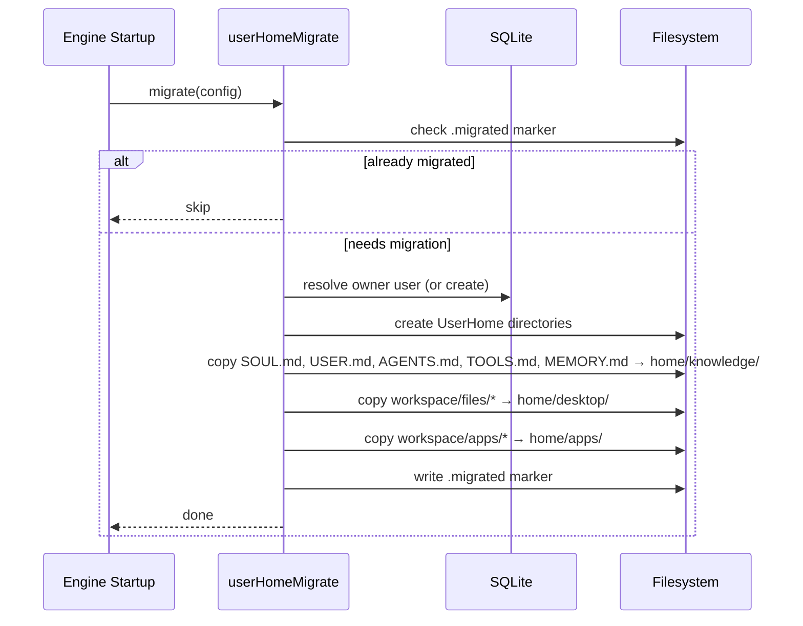

# Rework User Folder Structure

## Overview
Rework Daycare's flat shared file layout into per-user isolated home directories. Each user gets their own folder tree under `.daycare/users/<userid>/home/` with dedicated areas for desktop, documents, developer workspace, skills, apps, and knowledge files.

**Problem**: All users currently share one set of memory files (SOUL.md, USER.md, etc.), one workspace, one files dir, and one skill folder. No user isolation exists on disk despite having per-user identity in SQLite.

**Key benefits**:
- Each user's data is fully sandboxed (knowledge, files, skills, apps, workspace)
- Clean `UserHome` abstraction for all per-user path resolution
- Foundation for future sharing features (explicitly not implemented yet)

## Context (from discovery)

### Current state
- Users DB already exists in SQLite (`users`, `user_connector_keys` tables)
- `AgentContext(agentId, userId)` already threads user identity through the runtime
- `AgentSystem.resolveUserIdForDescriptor()` already resolves connector keys to user IDs
- All file paths are flat in `~/.daycare/` — no per-user directories on disk
- Prompt files (SOUL.md, USER.md, AGENTS.md, TOOLS.md, MEMORY.md) are shared globally
- Skills at `~/.agents/skills/`, apps at `<workspace>/apps/`, files at `<workspace>/files/`

### Files/components involved
- `sources/paths.ts` — default path constants (memory files, skills root)
- `sources/config/configResolve.ts` — derives `Config` snapshot with all paths
- `sources/config/configTypes.ts` — `Config` type definition
- `sources/engine/permissions.ts` — `SessionPermissions` type
- `sources/engine/permissions/permissionBuildDefault.ts` — builds default permissions
- `sources/engine/agents/agent.ts` — `Agent.create()` clones default permissions, calls `agentPromptFilesEnsure`
- `sources/engine/agents/agentSystem.ts` — resolves user IDs, creates agents
- `sources/engine/agents/ops/agentPromptPathsResolve.ts` — resolves memory file paths from dataDir
- `sources/engine/agents/ops/agentPromptFilesEnsure.ts` — seeds default memory files
- `sources/engine/agents/ops/agentSystemPromptSectionMemory.ts` — injects memory into prompts
- `sources/engine/agents/ops/agentSystemPromptSectionPermissions.ts` — injects permission paths into prompts
- `sources/engine/skills/skillListUser.ts` — loads skills from `~/.agents/skills`
- `sources/engine/skills/skills.ts` — `Skills` facade (4-source aggregation)
- `sources/engine/apps/appDiscover.ts` — discovers apps from `<workspace>/apps/`
- `sources/engine/apps/appManager.ts` — `Apps` facade, takes `workspaceDir`
- `sources/files/store.ts` — `FileStore` with `config.filesDir`

## Target Folder Structure

```
.daycare/
  settings.json
  auth.json
  daycare.db
  agents/                              # global, system-managed
    <agent-cuid2>/
  users/                               # per-user directories
    <user-cuid2>/
      home/
        desktop/                       # file attachments, default workingDir (was: filesDir)
        documents/                     # general documents
        developer/                     # workspace code (was: workspaceDir)
        skills/                        # user-installed skills
        apps/                          # per-user app installs
          <app-id>/
            APP.md
            PERMISSIONS.md
            data/
        knowledge/
          SOUL.md                      # personality
          USER.md                      # user facts
          AGENTS.md                    # workspace playbook
          TOOLS.md                     # tool notes
          MEMORY.md                    # working memory
```

Note: `~/.agents/skills/` remains as read-only system-level skills. `home/skills/` is for user-specific skills.

## Development Approach
- **Testing approach**: Regular (code first, then tests)
- Complete each task fully before moving to the next
- Make small, focused changes
- **CRITICAL: every task MUST include new/updated tests** for code changes in that task
- **CRITICAL: all tests must pass before starting next task**
- **CRITICAL: update this plan file when scope changes during implementation**

## Testing Strategy
- **Unit tests**: required for every task
- Pure functions get dedicated `*.spec.ts` files
- Test both success and error scenarios

## Progress Tracking
- Mark completed items with `[x]` immediately when done
- Add newly discovered tasks with `➕` prefix
- Document issues/blockers with `⚠️` prefix

## Implementation Steps

### Task 1: Create UserHome facade with path resolution
Create the `UserHome` class that encapsulates all per-user path resolution.

- [ ] Create `sources/engine/users/userHome.ts` — `UserHome` class with constructor `(usersDir: string, userId: string)` exposing:
  - `root` → `<usersDir>/<userId>`
  - `home` → `<root>/home`
  - `desktop` → `<home>/desktop`
  - `documents` → `<home>/documents`
  - `developer` → `<home>/developer`
  - `skills` → `<home>/skills`
  - `apps` → `<home>/apps`
  - `knowledge` → `<home>/knowledge`
  - `knowledgePaths()` → `AgentPromptFilesPaths` (SOUL.md, USER.md, AGENTS.md, TOOLS.md, MEMORY.md in `knowledge/`)
- [ ] Write tests for all `UserHome` path getters in `userHome.spec.ts`
- [ ] Run tests — must pass before next task

### Task 2: Add usersDir to Config and create user home directory initialization
Wire `usersDir` into config and add directory creation logic.

- [ ] Add `usersDir` to `Config` type in `configTypes.ts` — value: `path.join(dataDir, "users")`
- [ ] Update `configResolve.ts` to compute and include `usersDir`
- [ ] Create `sources/engine/users/userHomeEnsure.ts` — given a `UserHome`, creates the full directory tree (desktop, documents, developer, skills, apps, knowledge) and seeds knowledge files from bundled templates via `agentPromptFilesEnsure`
- [ ] Write tests for `userHomeEnsure` — verify all directories and knowledge files created
- [ ] Run tests — must pass before next task

### Task 3: Build per-user permissions
Create permission builder scoped to a user's home directory.

- [ ] Create `sources/engine/permissions/permissionBuildUser.ts`:
  - Takes a `UserHome` instance
  - Returns `SessionPermissions` where:
    - `workspaceDir` = `home`
    - `workingDir` = `home/desktop`
    - `writeDirs` = `[home/desktop, home/documents, home/developer, home/knowledge/SOUL.md, home/knowledge/USER.md, home/knowledge/AGENTS.md, home/knowledge/TOOLS.md, home/knowledge/MEMORY.md]`
    - `readDirs` = `[...writeDirs, home/skills]` (skills are readable but not writable by agents)
    - Apps are excluded (app system manages its own permissions)
- [ ] Write tests for `permissionBuildUser` — verify home dirs writable, skills read-only, apps excluded, knowledge files writable
- [ ] Run tests — must pass before next task

### Task 4: Wire UserHome into agent creation
Thread `UserHome` through agent system so user-type agents get per-user paths and permissions.

- [ ] Modify `AgentSystem.resolveEntry()` to build `UserHome` for resolved userId and pass to `Agent.create()`
- [ ] Modify `Agent.create()` to accept optional `UserHome` — when present, use `permissionBuildUser(userHome)` instead of `config.defaultPermissions`
- [ ] Call `userHomeEnsure(userHome)` during agent creation to ensure directory tree exists
- [ ] Write tests for agent creation with UserHome permissions
- [ ] Run tests — must pass before next task

### Task 5: Route prompt/memory files to user's knowledge directory
Make system prompt memory and permissions sections read from user-specific knowledge paths.

- [ ] Modify `agentPromptPathsResolve.ts` to accept optional `UserHome` parameter — when provided, resolve to `home/knowledge/*.md` paths
- [ ] Modify `agentSystemPromptSectionMemory.ts` to pass `UserHome` when available (from agent's userId → UserHome)
- [ ] Modify `agentSystemPromptSectionPermissions.ts` to use user-specific knowledge paths
- [ ] Modify `agent.ts` line 372 (`agentPromptFilesEnsure`) to use user-specific knowledge paths when UserHome available
- [ ] Write tests for prompt path resolution with UserHome
- [ ] Run tests — must pass before next task

### Task 6: Route file storage to user's desktop directory
Make `FileStore` write to user-specific `home/desktop/` folder.

- [ ] Modify `FileStore` constructor to accept a base path directly (instead of only `config.filesDir`)
- [ ] When creating `FileStore` for user-type agents, pass `userHome.desktop` as the base path
- [ ] Update any connector file handling to route to user's desktop when user is resolved
- [ ] Write tests for user-scoped file storage
- [ ] Run tests — must pass before next task

### Task 7: Route skills to user's home/skills directory
Load user-specific skills from the user's `home/skills/` folder alongside system-level skills.

- [ ] Modify `skillListUser.ts` to accept an optional user skills path parameter
- [ ] Update `Skills` facade to accept optional user skills path — when present, load from both `~/.agents/skills/` (system) and `userHome.skills` (user)
- [ ] In agent context building, pass user's skill path to the Skills facade
- [ ] Write tests for loading skills from user dir alongside system skills
- [ ] Run tests — must pass before next task

### Task 8: Route apps to user's home/apps directory
Update app discovery and management to use user-specific `home/apps/` directory.

- [ ] Modify `appDiscover.ts` to accept a user apps path — scan `userHome.apps` instead of `<workspace>/apps/`
- [ ] Modify `Apps` facade to accept user-scoped apps dir
- [ ] Update `appPermissionStateGrant`/`appPermissionStateRead`/`appPermissionStateWrite` to use user-scoped paths
- [ ] Update `agentAppFolderPathResolve` to use user-scoped app path
- [ ] Write tests for user-scoped app discovery and permission state
- [ ] Run tests — must pass before next task

### Task 9: Add migration for existing owner user data
Auto-migrate shared files into the owner user's home directory on startup.

- [ ] Create `sources/engine/users/userHomeMigrate.ts`:
  - Detects legacy shared files (SOUL.md, USER.md, AGENTS.md, TOOLS.md, MEMORY.md in dataDir)
  - Resolves owner user from SQLite (or creates one if none exists)
  - Builds `UserHome` for owner
  - Copies shared knowledge files into `home/knowledge/`
  - Moves `<workspace>/files/*` into `home/desktop/`
  - Moves `<workspace>/apps/*` into `home/apps/`
  - Does NOT delete originals (leaves them for manual cleanup)
  - Writes a `.migrated` marker file to avoid re-running
- [ ] Call migration at engine startup (after DB is ready, before agents load)
- [ ] Write tests for migration logic — verify files copied, marker written, idempotent on re-run
- [ ] Run tests — must pass before next task

### Task 10: Verify acceptance criteria
- [ ] Verify: new user gets full directory structure (home/desktop, documents, developer, skills, apps, knowledge with 5 .md files)
- [ ] Verify: agent for user-type descriptor gets permissions scoped to user's home
- [ ] Verify: memory/knowledge files are read from user's knowledge directory
- [ ] Verify: files are stored in user's desktop
- [ ] Verify: skills are loaded from both system and user directories
- [ ] Verify: apps are discovered from user's apps directory
- [ ] Verify: migration copies legacy shared data into owner user's home
- [ ] Run full test suite (unit tests)
- [ ] Run linter — all issues must be fixed

### Task 11: [Final] Update documentation
- [ ] Create `sources/engine/users/README.md` documenting UserHome and the folder structure
- [ ] Update `doc/STORAGE.md` with new per-user directory layout
- [ ] Add mermaid diagram of user home resolution flow

## Technical Details

### UserHome Class
```typescript
class UserHome {
  readonly root: string;       // .daycare/users/<userId>
  readonly home: string;       // .daycare/users/<userId>/home
  readonly desktop: string;    // .daycare/users/<userId>/home/desktop
  readonly documents: string;  // .daycare/users/<userId>/home/documents
  readonly developer: string;  // .daycare/users/<userId>/home/developer
  readonly skills: string;     // .daycare/users/<userId>/home/skills
  readonly apps: string;       // .daycare/users/<userId>/home/apps
  readonly knowledge: string;  // .daycare/users/<userId>/home/knowledge

  constructor(usersDir: string, userId: string);
  knowledgePaths(): AgentPromptFilesPaths;
}
```

### Permission Construction
```typescript
function permissionBuildUser(userHome: UserHome): SessionPermissions {
  const knowledgePaths = userHome.knowledgePaths();
  return {
    workspaceDir: userHome.home,
    workingDir: userHome.desktop,
    writeDirs: [
      userHome.desktop,
      userHome.documents,
      userHome.developer,
      knowledgePaths.soulPath,
      knowledgePaths.userPath,
      knowledgePaths.agentsPath,
      knowledgePaths.toolsPath,
      knowledgePaths.memoryPath,
    ],
    readDirs: [
      userHome.desktop,
      userHome.documents,
      userHome.developer,
      userHome.skills,          // read-only for agents
      knowledgePaths.soulPath,
      knowledgePaths.userPath,
      knowledgePaths.agentsPath,
      knowledgePaths.toolsPath,
      knowledgePaths.memoryPath,
    ],
    network: false,
    events: false,
  };
}
```

### Migration Flow


## Post-Completion

**Manual verification**:
- Test with Telegram connector: send message from new user, verify user home directory created
- Verify agent can read/write within home/ but not outside
- Verify legacy data is migrated for existing installations
- Verify system-level skills (`~/.agents/skills/`) still work alongside user skills

**Future work** (not in scope):
- Sharing between users (skills, documents, etc.)
- User deletion / data export
- Per-skill writable data directories
- Secret engine with unix socket proxying
