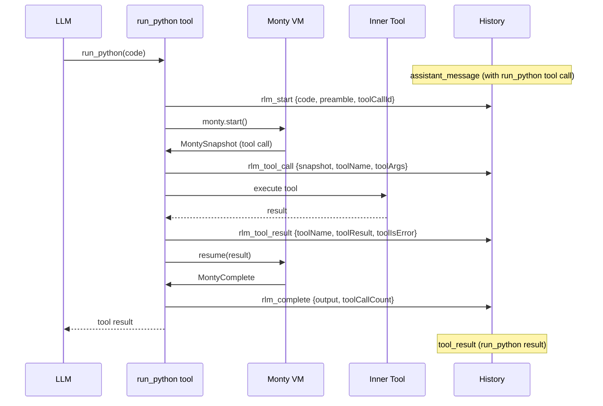
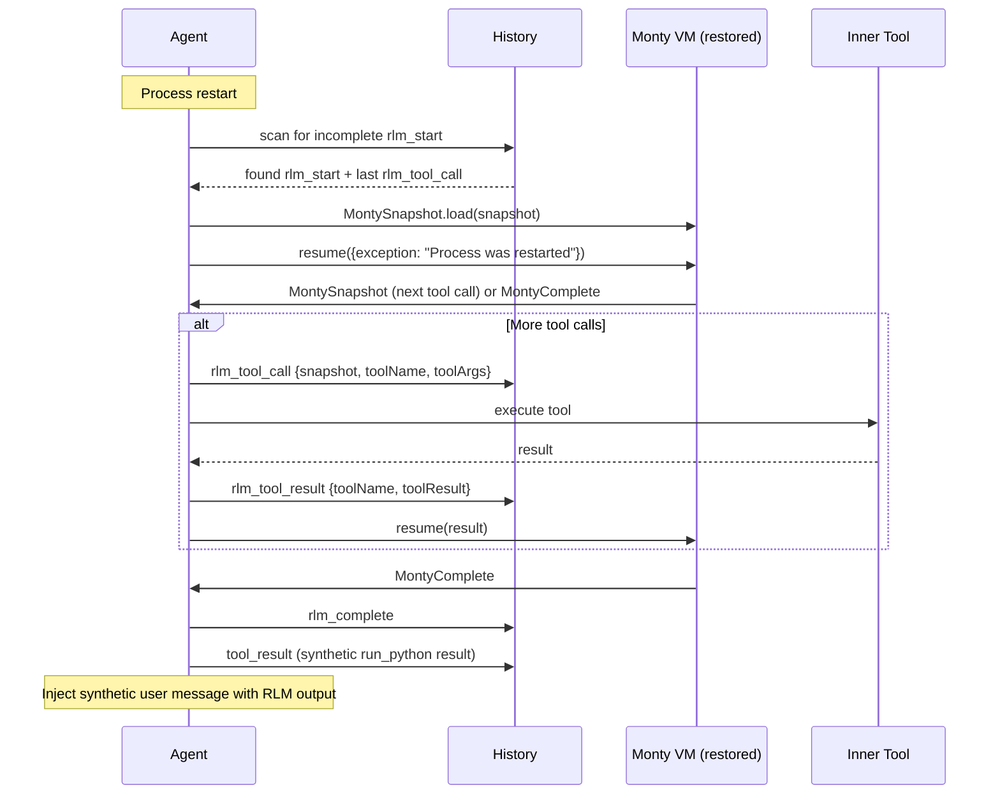

# RLM Checkpointing

## Overview
- Persist RLM execution state to history so VM execution survives process restarts
- On each `run_python` call, record: start (with code), snapshot before each tool call, result after each tool call, and final completion
- Snapshot is taken *before* the tool call (VM is paused at the external function invocation). A separate `rlm_tool_result` record is written after the tool call completes.
- On process restart with incomplete RLM execution: restore VM from last snapshot, resume execution where first tool call throws "process was restarted" error (Python code can catch or crash), then inject result as synthetic user message
- Uses the existing history JSONL system with 4 new record types

## Context
- **RLM execution**: `engine/modules/rlm/rlmExecute.ts` — core VM loop, already uses `snapshot.dump()` / `MontySnapshot.load()` for timer resets
- **RLM tool**: `engine/modules/rlm/rlmTool.ts` — `rlmToolBuild()` entry point, calls `rlmExecute()`
- **History types**: `engine/agents/ops/agentTypes.ts` — `AgentHistoryRecord` discriminated union
- **History write**: `engine/agents/ops/agentHistoryAppend.ts` — appends JSONL records
- **History validation**: `engine/agents/ops/agentHistoryRecordsLoad.ts` — Zod schema for parsing
- **Crash recovery**: `engine/agents/ops/agentHistoryPendingToolResults.ts` — synthetic error results for incomplete tool calls
- **Agent restore**: `agent.ts` `completePendingToolCalls()` (line 897) and `handleMessage()` (line 340)
- **Agent loop**: `engine/agents/ops/agentLoopRun.ts` — tool execution + history recording flow
- **History→context**: `agent.ts` `buildHistoryContext()` (line 1027) — reconstructs messages from records

## Development Approach
- **Testing approach**: Regular (code first, then tests)
- Complete each task fully before moving to the next
- Make small, focused changes
- **CRITICAL: every task MUST include new/updated tests**
- **CRITICAL: all tests must pass before starting next task**
- **CRITICAL: update this plan file when scope changes during implementation**

## Progress Tracking
- Mark completed items with `[x]` immediately when done
- Add newly discovered tasks with ➕ prefix
- Document issues/blockers with ⚠️ prefix

## Implementation Steps

### Task 1: Add RLM history record types
- [x] Add `rlm_start` record type to `AgentHistoryRecord` in `agentTypes.ts`:
  ```typescript
  | {
      type: "rlm_start";
      at: number;
      toolCallId: string;   // the run_python tool call ID
      code: string;          // user's Python code
      preamble: string;      // generated preamble
    }
  ```
- [x] Add `rlm_tool_call` record type to `AgentHistoryRecord` (written *before* tool call):
  ```typescript
  | {
      type: "rlm_tool_call";
      at: number;
      toolCallId: string;        // the run_python tool call ID
      snapshot: string;           // base64-encoded VM snapshot from dump()
      printOutput: string[];      // accumulated print output so far
      toolCallCount: number;      // tool calls executed so far
      toolName: string;           // name of the tool about to be called
      toolArgs: unknown;          // arguments to be passed to the tool
    }
  ```
- [x] Add `rlm_tool_result` record type to `AgentHistoryRecord` (written *after* tool call):
  ```typescript
  | {
      type: "rlm_tool_result";
      at: number;
      toolCallId: string;        // the run_python tool call ID
      toolName: string;           // name of the tool that was called
      toolResult: string;         // text result returned from tool
      toolIsError: boolean;       // whether the tool returned an error
    }
  ```
- [x] Add `rlm_complete` record type to `AgentHistoryRecord`:
  ```typescript
  | {
      type: "rlm_complete";
      at: number;
      toolCallId: string;    // the run_python tool call ID
      output: string;        // final VM output
      printOutput: string[]; // all print output
      toolCallCount: number; // total tool calls
      isError: boolean;      // whether execution ended in error
      error?: string;        // error message if isError
    }
  ```
- [x] Add Zod schemas for all 4 new types in `agentHistoryRecordsLoad.ts` discriminated union
- [x] Export new types from `@/types` if needed
- [x] Write tests for Zod schema validation (valid + invalid records)
- [x] Run tests — must pass before next task

### Task 2: Add history callback to `rlmExecute`
- [x] Add `RlmHistoryCallback` type in `rlmExecute.ts`:
  ```typescript
  type RlmHistoryCallback = (record: AgentHistoryRecord) => Promise<void>;
  ```
- [x] Add optional `historyCallback` parameter to `rlmExecute()` signature
- [x] Emit `rlm_start` record at the beginning of execution (after script assembly, before `monty.start()`)
- [x] Before each tool call: serialize snapshot via `snapshot.dump()`, base64-encode it, and emit `rlm_tool_call` record with tool name, args, and accumulated state (print output, tool call count)
- [x] After each tool call completes: emit `rlm_tool_result` record with tool name, result text, and isError flag
- [x] On successful completion, emit `rlm_complete` record with `isError: false`
- [x] On error (catch blocks in `rlmTool.ts`), emit `rlm_complete` record with `isError: true` and error message
- [x] Update `rlmTool.ts` `execute` to pass a history callback that delegates to the context's `appendHistoryRecord` (threaded from agent loop)
- [x] Write tests for `rlmExecute` checkpoint emissions (mock callback, verify record sequence)
- [x] Run tests — must pass before next task

### Task 3: Thread history callback through tool execution
- [x] Add optional `appendHistoryRecord` to `ToolExecutionContext` in `tools/types.ts`
- [x] In `agentLoopRun.ts`, pass the `appendHistoryRecord` callback into the `ToolExecutionContext` when calling `toolResolver.execute()`
- [x] In `rlmTool.ts`, read `context.appendHistoryRecord` and pass it to `rlmExecute()`
- [x] Write test verifying `appendHistoryRecord` is passed through correctly
- [x] Run tests — must pass before next task

### Task 4: Build RLM restore function
- [x] Create `engine/modules/rlm/rlmRestore.ts` with function `rlmRestore()`:
  - Accepts: last `rlm_tool_call` record, `rlm_start` record, tool resolver, execution context, history callback
  - Decodes base64 snapshot, calls `MontySnapshot.load()` to restore VM
  - Resumes VM with `{ exception: { type: "RuntimeError", message: "Process was restarted" } }` — this throws inside the Python tool call that was pending
  - Continues the normal execution loop (same as `rlmExecute` loop) for subsequent tool calls
  - Returns `RlmExecuteResult` (same shape as `rlmExecute`)
  - Emits `rlm_tool_call` + `rlm_tool_result` records for any subsequent tool calls
  - Emits `rlm_complete` record when done
- [x] Handle edge case: if VM completes immediately after restart error (no more tool calls), still emit `rlm_complete`
- [x] Write tests for `rlmRestore` (mock MontySnapshot.load, verify restart error is thrown, verify subsequent execution continues)
- [x] Run tests — must pass before next task

### Task 5: Detect and execute RLM restore during startup
- [x] Create `engine/agents/ops/agentHistoryPendingRlmResolve.ts` with function `agentHistoryPendingRlmResolve()`:
  - Scans history records for an `rlm_start` without a matching `rlm_complete` (same `toolCallId`)
  - If found, locates the latest `rlm_tool_call` for that `toolCallId` (or uses `rlm_start` if no snapshots exist)
  - Returns `{ start: RlmStartRecord, lastSnapshot: RlmSnapshotRecord | null }` or `null` if no pending RLM
- [x] In `agent.ts` `completePendingToolCalls()`, after existing pending tool call logic:
  - Call `agentHistoryPendingRlmResolve()` to check for incomplete RLM
  - If found and there IS a snapshot: call `rlmRestore()` to resume VM execution
  - If found but NO snapshot (crashed before any tool call): emit `rlm_complete` with `isError: true` and message "Process was restarted before any tool call"
  - Build the `run_python` tool result from the restore result (same format as `rlmTool.ts` `buildResult`)
  - Append the synthetic `tool_result` record to history (completing the pending `run_python` call)
  - Inject the RLM execution result as a synthetic user message into context: `<system_message origin="rlm_restore">RLM execution completed after restart. Output: ...</system_message>`
- [x] Write tests for `agentHistoryPendingRlmResolve` (various history states: no RLM, complete RLM, incomplete with snapshots, incomplete without snapshots)
- [x] Run tests — must pass before next task

### Task 6: Handle RLM restore in history→context reconstruction
- [x] In `agent.ts` `buildHistoryContext()`, handle new record types:
  - `rlm_start`: skip (internal detail, the outer `assistant_message` with the `run_python` tool call already represents it)
  - `rlm_tool_call`: skip (internal detail)
  - `rlm_tool_result`: skip (internal detail)
  - `rlm_complete`: skip (the outer `tool_result` for `run_python` already covers it)
- [x] Verify that the synthetic `tool_result` and synthetic user message from restore are correctly reconstructed from their history records
- [x] Write tests verifying `buildHistoryContext` correctly handles conversations with RLM checkpoint records
- [x] Run tests — must pass before next task

### Task 7: Verify acceptance criteria
- [x] Verify: `rlm_start` record is written when `run_python` begins (includes code)
- [x] Verify: `rlm_tool_call` is written before each inner tool call (includes serialized VM + tool name/args)
- [x] Verify: `rlm_tool_result` is written after each inner tool call (includes result + isError)
- [x] Verify: `rlm_complete` is written when RLM finishes (includes output)
- [x] Verify: on restart with incomplete RLM, VM is restored from last snapshot
- [x] Verify: first tool call after restore throws "Process was restarted" via tool error (RuntimeError in Python)
- [x] Verify: VM continues executing after the restart error (Python can catch/handle)
- [x] Verify: restored RLM result appears as synthetic user message in context
- [x] Run full test suite (`yarn test`)
- [x] Run typecheck (`yarn typecheck`)

### Task 8: Update documentation
- [x] Create `doc/internals/rlm-checkpointing.md` with:
  - Overview of checkpoint records and their lifecycle
  - Mermaid diagram: normal execution flow with checkpoint writes
  - Mermaid diagram: restore flow on process restart
  - Record type reference
- [x] Update RLM module README if one exists

## Technical Details

### Record lifecycle — normal execution



### Record lifecycle — restore after crash



### Snapshot storage format
- `snapshot.dump()` returns binary data (Uint8Array)
- Stored as base64-encoded string in `rlm_tool_call.snapshot` field
- Restored via `MontySnapshot.load(Buffer.from(base64, 'base64'))`

## Post-Completion

**Manual verification:**
- Test with a multi-tool RLM script, kill process mid-execution, restart and verify restore
- Verify history.jsonl is not growing unreasonably with checkpoint data
- Check that base64 snapshot size is manageable (monitor for large snapshots)
