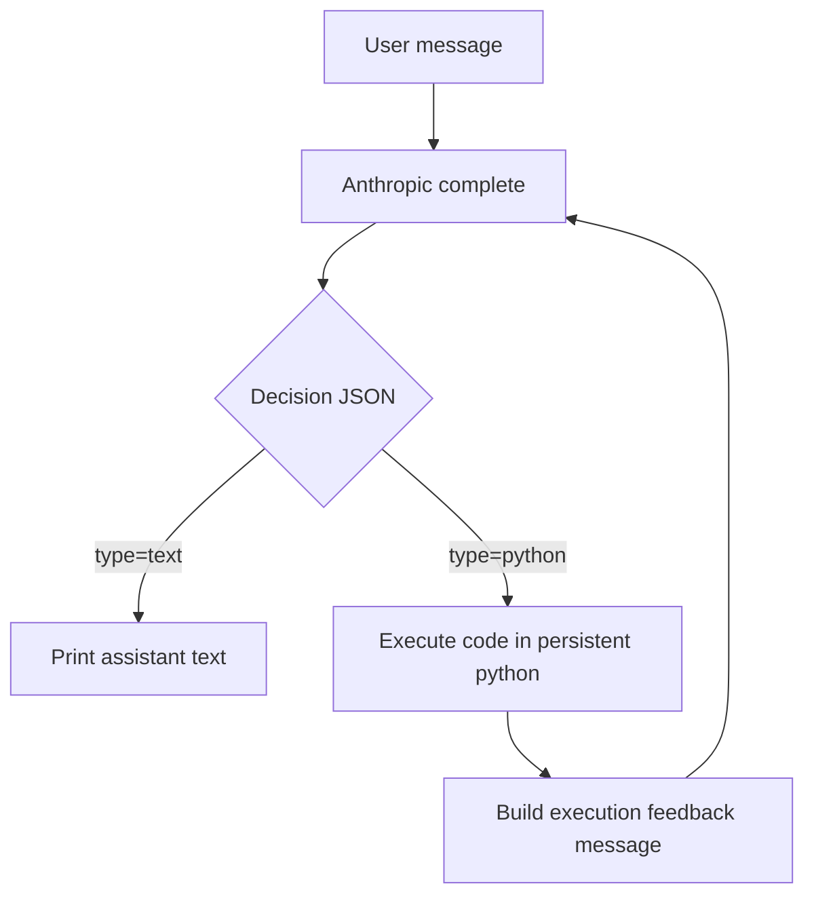

# Recipe: PyREPL

Adds a new recipe entry:
- `yarn recipe pyrepl [modelId] [sandboxName]`

Source entry:
- `packages/daycare/sources/recipe/recipePyrepl.ts`

Behavior:
- runs a sequential loop with a system prompt that explains a strict JSON protocol:
  - `{"type":"text","text":"..."}`
  - `{"type":"python","code":"...","text":"optional intent"}`
- executes python actions in a persistent system `python3` subprocess
- uses a recipe sandbox directory under `sources/recipe/.sandbox/<sandboxName>`
- returns stdout/stderr/result/error back into the next model turn

Sandbox notes:
- sandbox write checks are enforced in the python bridge for common file write operations
- write target is restricted to the sandbox directory

