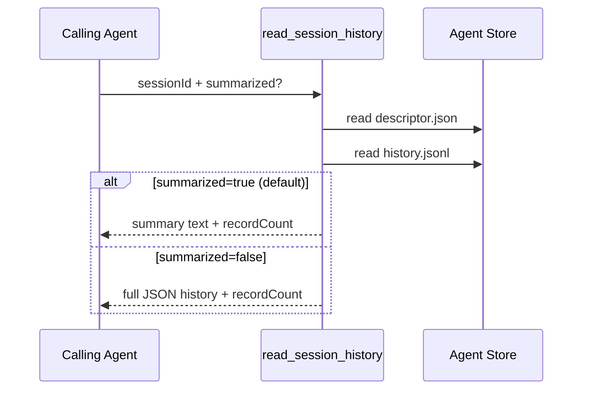

# Session History Tool

`read_session_history` lets an agent inspect another session's history by `sessionId`.

- `sessionId`: target session id to read (required)
- `summarized`: when omitted, defaults to `true`
  - `true`: return a compact summary with counts, range, and latest snapshots
  - `false`: return full JSON history payload

