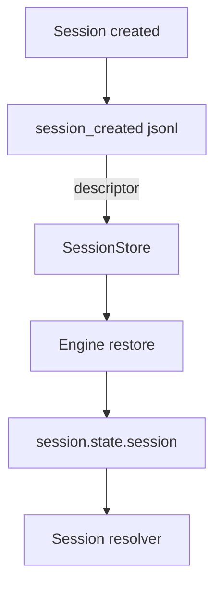
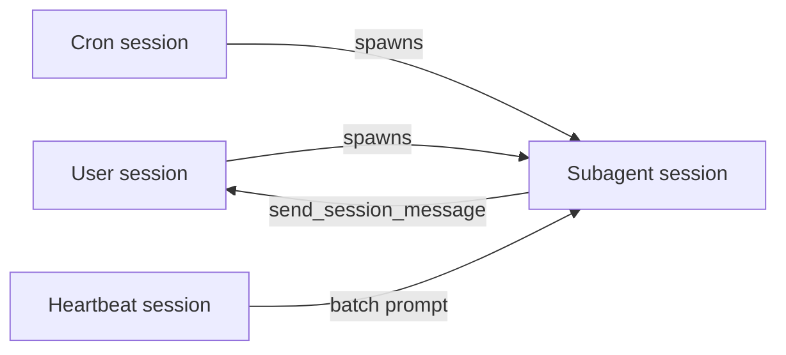
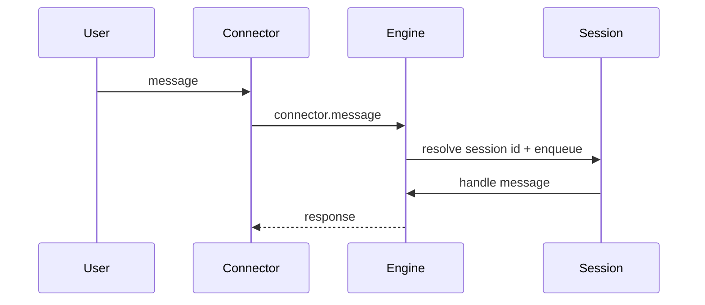
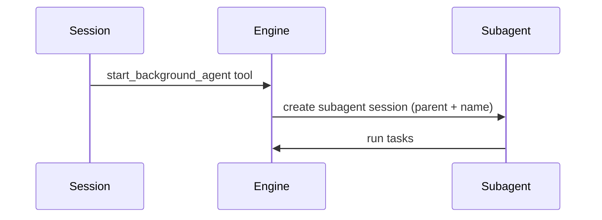
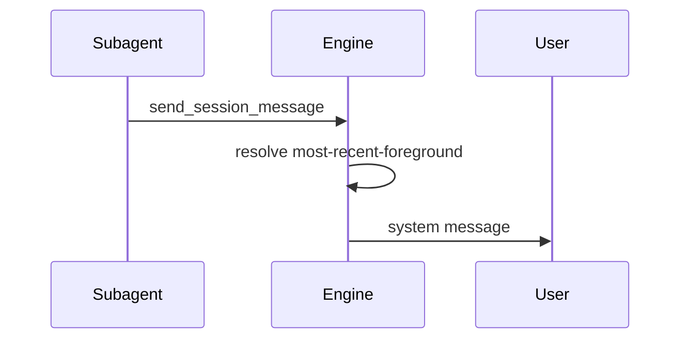

# Session types

Session types are persisted descriptors that capture what a session represents
and how it should be resolved later. They are written once when a session is
created and restored on boot to keep routing stable across restarts.



## Descriptor shape

Session descriptors live in `session.state.session` and are persisted in the
first `session_created` log entry.

```ts
type SessionDescriptor =
  | { type: "user"; connector: string; userId: string; channelId: string }
  | { type: "cron"; id: string }
  | { type: "heartbeat" }
  | { type: "subagent"; id: string; parentSessionId: string; name: string };
```

Notes:
- `user` is a foreground connector conversation.
- `cron` maps to a scheduled task id.
- `heartbeat` maps to the single heartbeat batch session.
- `subagent` is any background agent and always includes a parent + name.

## Persistence rules

1. On session creation, the engine builds a descriptor and writes it into the
   `session_created` JSONL record.
2. On restart, the session store restores the descriptor from that first record
   and the engine rehydrates it into `session.state.session`.
3. No backward-compatibility shims: descriptors are not re-derived from context
   if the persisted descriptor is missing.

## Fetch strategies

Only two fetch strategies are supported:

```ts
type SessionFetchStrategy = "most-recent-foreground" | "heartbeat";
```

Resolution behavior:
- `most-recent-foreground` selects the most recent session with a `user`
  descriptor.
- `heartbeat` selects the most recent session with a `heartbeat` descriptor.

## How session types operate together



Operational notes:
- User sessions are the only sessions treated as foreground.
- Subagents always have a parent (usually a user session, cron, or heartbeat).
- Heartbeat runs always map to a single `heartbeat` session that launches a
  subagent with a batch prompt.
- Cron sessions are scheduled inputs; they can spawn subagents but are not
  foreground targets.

## Message routing

### User message to session



Routing notes:
- Session id is resolved from the persisted `user` descriptor (connector + user + channel).
- The session queue preserves ordering; updates are persisted on each step.

### Session to subagent



Routing notes:
- Subagent sessions always carry `parentSessionId` and `name`.
- The subagent session descriptor is persisted on creation.

### Subagent back to user



Routing notes:
- The `most-recent-foreground` strategy selects the most recent `user` session.
- Subagents default to their `parentSessionId`; other sessions fall back to
  `most-recent-foreground` when no session id is provided.

## Implementation references

- Descriptor type + normalization: `packages/claybot/sources/engine/sessions/descriptor.ts`
- Persistence: `packages/claybot/sources/engine/sessions/store.ts`
- Resolver + usage: `packages/claybot/sources/engine/engine.ts`
