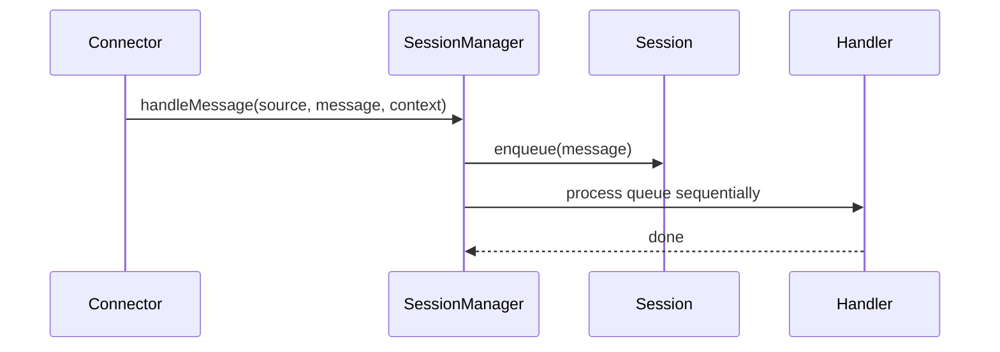

# Sessions

Sessions provide per-channel sequencing of messages, ensuring each session is handled one message at a time.

## Session rules
- Session id defaults to `${source}:${channelId}`.
- A connector can override with `context.sessionId`.
- Messages are queued and processed in order.

## Key types
- `SessionMessage` stores message, context, and timestamps.
- `SessionContext` holds mutable per-session state.
