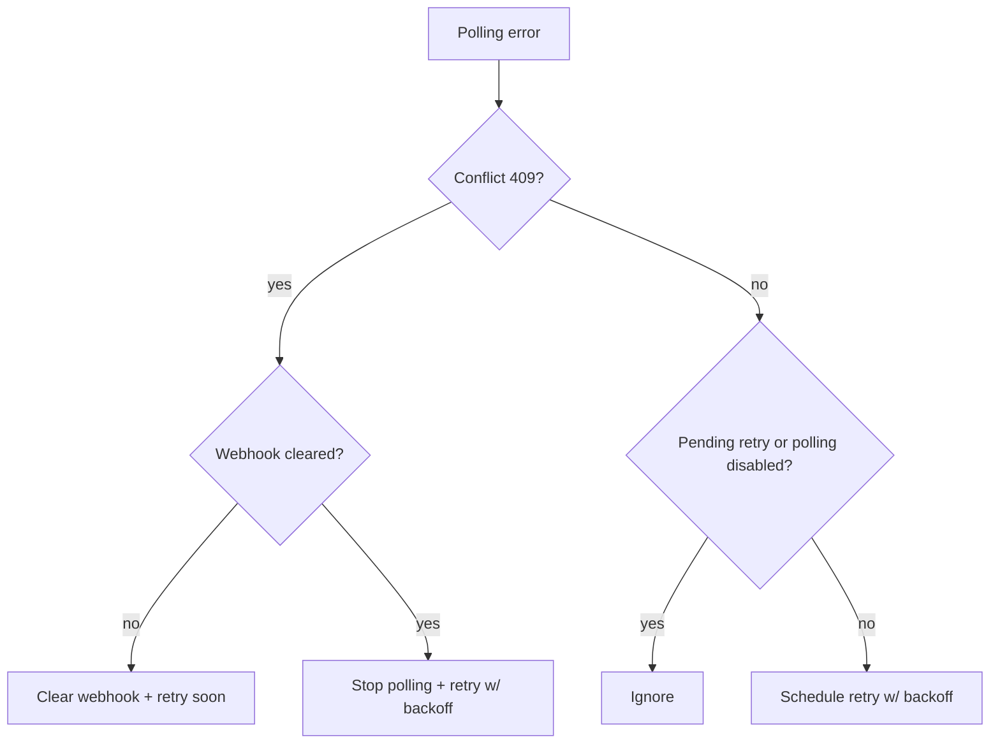

# Telegram polling retry

This note documents how the Telegram connector handles polling errors and conflicts.

## Notes
- Polling restarts are owned by the connector retry logic; the underlying library is started with `restart: false`.
- A polling conflict stops the current polling loop and continues retrying with backoff.
- `startPolling` is guarded to avoid concurrent start attempts while a previous start is still in flight.
