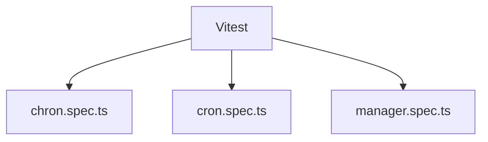

# Testing

Tests live alongside sources and use `*.spec.ts`.

Current coverage:
- `cron.spec.ts` verifies cron scheduler dispatch and actions.
- `connectors/chron.spec.ts` verifies chron connector scheduling.
- `sessions/manager.spec.ts` verifies per-session sequencing.

